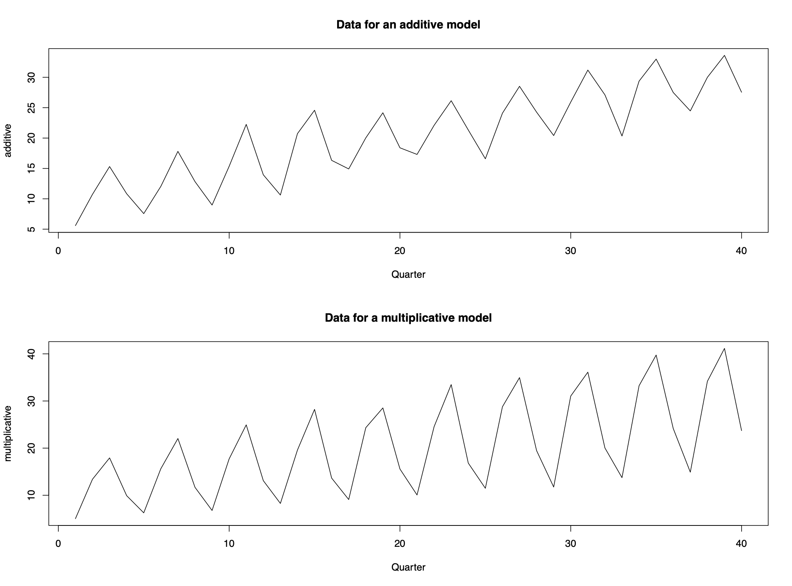
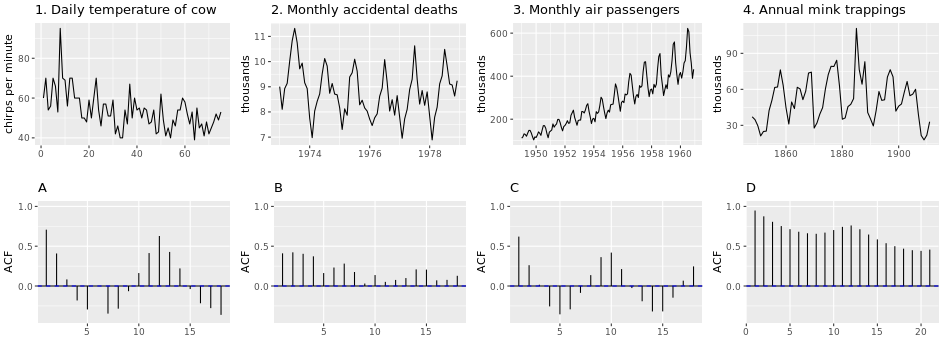

```{r setup, include=FALSE} 
knitr::opts_chunk$set(warning = FALSE, message = FALSE) 
```

# Chapter 1: Time Series Fundamentals

## Definition
$$\{X_t|t\in T \}$$
where $X_t$ denotes random variables that are continuous, $T$ denotes index sets that are discrete and equally spaced in time

$x_t$ denotes observations, or realisations of $X_t$


## White Noise: purely random process

$$E[X_t]=\mu$$
$Var[X_t]=\sigma^2$ where each $X_t$ is independent

It asssumes the observations are all independent


## Random Walk: random but dependent
$$ X_T = X_{t-1} +Z_t$$
where $Z_t$ is a purely random process with mean $\mu$ and variance $\sigma^2$

```{r echo=FALSE, message=FALSE}
library(ggplot2)
library(lubridate)
library(gridExtra)
set.seed(1)
n <- 100
G.wn <- rnorm(n) # Guassian white noise
E.wn <- rexp(n) # exponential white noise
G.rw <- rep(0, n) # set up for Gaussian random walk
E.rw <- rep(0, n) # set up for exponential random walk

for(i in 2:n)
{
G.rw[i] <- G.rw[(i-1)]  + rnorm(1)
E.rw[i] <- E.rw[(i-1)]  + rexp(1)
}

# Convert simulated data to data frames to plot using ggplot
G.wn <- as.data.frame(cbind(1:n, G.wn))
colnames(G.wn) <- c("n", "Y")

E.wn <- as.data.frame(cbind(1:n, E.wn))
colnames(E.wn) <- c("n", "Y")

G.rw <- as.data.frame(cbind(1:n, G.rw))
colnames(G.rw) <- c("n", "Y")

E.rw <- as.data.frame(cbind(1:n, E.rw))
colnames(E.rw) <- c("n", "Y")

plot.G.wn <- ggplot(data = G.wn, aes(x = n, y = Y)) +
              geom_line() +
              labs(x = "Time", y = "Y",
                   title = "Gaussian white noise") 

plot.E.wn <- ggplot(data = E.wn, aes(x = n, y = Y)) +
              geom_line() +
              labs(x = "Time", y = "Y",
                   title = "Exponential white noise") 

plot.G.rw <- ggplot(data = G.rw, aes(x = n, y = Y)) +
              geom_line() +
              labs(x = "Time", y = "Y",
                   title = "Gaussian random walk") 

plot.E.rw <- ggplot(data = E.rw, aes(x = n, y = Y)) +
              geom_line() +
              labs(x = "Time", y = "Y",
                   title = "Exponential random walk") 

grid.arrange(plot.G.wn, plot.E.wn, plot.G.rw, plot.E.rw)
```

## Time Series Modelling

Time series data are often decomposed into the following three components: Trend, Seasonal Effect, Unexplained variation



Data with additive structure is easier to analyze as compared to multiplicative structure. If the time series data has multiplicative structure, we can model it by using transformations.

### Log Transformation

$$log(X_t)=log(m_t\cdot s_t\cdot e_t)=log(m_t)+log(s_t)+log(e_t)$$

Use to stablize variance, make seasonal effect $s_t$ additive, & make the data normally distributed.

### Box-Cox Transformation

$$ y_t=(x_t^\lambda-1)/\lambda \space\space \lambda\ne0$$
$$ or \space y_t=ln(x_t) \space\space \lambda=0$$
where $\lambda$ is a tuning parameter chosen by the analyst

## Time Series Properties

### Mean function (if mean is constant)
$$\mu_t=E[X_t]$$
$$\hat \mu=\frac 1n\sum_{t=1}^{n}x_t$$
In case of walking average, see ch.2

### Variance function (if variance is constant)
$$\sigma_t^2=Var[X_t]=E[X_t^2]-E[X_t]^2$$
$$\hat \sigma^2=\frac1{n-1} \sum_{t=1}^n{(x_t-\hat\mu)^2}$$

### Autocovariance function (ACVF): 
$$\gamma_{s,t}=Cov[X_s,X_t]=E[X_sX_t]-E[X_t]E[X_s]$$
where $\gamma_{t,t}=Cov[X_t,X_t]=Var[X_t]=\sigma_t^2$

Real data:
$$\gamma_\tau=Cov[X_tX_{t+\tau}]$$ with lag $\tau=0,1,2,..$

### Autocorrelation function (ACF):
$$\rho_{s,t}=Corr[X_s,X_t]=\frac{Cov[X_s,X_t]}{\sqrt{Var[X_s]Var[X_t]}}=\frac{\gamma_{s,t}}{\sigma_s\sigma_t}$$
where $\rho_{t,t}=Corr[X_t,X_t]=1$

Real data:
$$\rho_\tau=Corr[X_tX_{t+\tau}]=\frac{Cov[X_t,X_{t+\tau}]}{\sqrt{Var[X_t]Var[X_{t+\tau}]}}=\frac{\gamma_\tau}{\gamma_0}$$

### Properties
Property 1: $\rho_\tau=\rho_{-\tau}$ 

Property 2: $|\rho_\tau|\leq1$ 

Property 3: Invertibility is not assumed

## Stationarity

A time series process $\{X_t|t\in T\}$ is strictly stationary if the joint distribution $f(X_{t1},...,X_{tk})$ is identical to the joint distribution $f(X_{t1+r},...,X_{tk+r})$ for all collections $t_1,...,t_k$ and separation values $r$. In other words, shifting the time origin of the series by $r$ has no effect on its joint distribution.


A time series process $\{X_t|t\in T\}$ is weakly stationary (or second-order stationary) if 1, mean function is constant and finite; 2, variance function is constant and finite; 3, autocovariance and autocorrelation functions only depend on the lag.

# Chapter 1 Lab 

Using R to dive in the building blocks of time series models. These building blocks include White Noise (WN), Random Walk (RW), Correlation analysis and ACF/PACF graphs, Autoregressive model (AR), and Moving Average (MA).

First thing to note is that sampling frequency tend to be not exact. If the data was recorded daily or hourly, that is exact sampling frequency. But if data is recorded monthly or yearly, it is not since months differ in number of days. 

Second thing to know is detrending. Detrending is necessary to remove variability resulted from "trend" over time (oftentimes using diff() or fitting a linear regression model). Think of this as standardized for analysis. Sometimes the data needs log transformation before detrending.

## White Noise (WN)

Introduce the simulation function: 

```{r echo=TRUE}
library(gridExtra)

WN_example_50 <- arima.sim(model = list(order = c(0,0,0)), n = 50)
WN_example_100 <- arima.sim(model = list(order = c(0,0,0)), n = 100)
WN_example_200 <- arima.sim(model = list(order = c(0,0,0)), n = 200)
WN_example_500 <- arima.sim(model = list(order = c(0,0,0)), n = 500)

ts.plot(WN_example_50)
```


```{r echo=TRUE}
par(mfrow = c(3,1))
```


```{r echo=TRUE}
ts.plot(WN_example_100)
ts.plot(WN_example_200)
ts.plot(WN_example_500)

# Plot your simulated data
# plot.ts(cbind(WN_example_50, WN_example_100, WN_example_200, WN_example_500))

```

Above are white noise with various sample sizes. The c(0,0,0) parameter in arima() function specifies the WN model as it leaves only the independent error term $X_t=\epsilon_t$

Note that WN model has no pattern or trend. Named after white light in physics which display similar characteristics.

## Random Walk (RW)

$$ X_T = X_{t-1} +Noise_t$$
with $Noise_t = Z_t (White noise)$

Think of White Noise but with trend. The value of the next period depends on the value of the previous with a random level of noise. 

```{r echo=TRUE}
random_walk <- arima.sim(model = list(order = c(0, 1, 0)), n = 100)
plot(random_walk)
```

Parameters 0,1,0 specifies Random Walk. Note that at $t=1$, $X_{t-1}=0$, meaning that the first data point in a random walk series is purely random error and the data points at higher time $t$ is the previous value plus an independent error value of mean 0 and variance $\hat \sigma^2=1$. Note that the plot would also be different every time it's being regenerated due to its random nature.

## Stationary 

Stationary is preferable since its behavior can be modeled with fewer parameter (which we will get into in ARIMA).  

### Examples: CPI Data

```{r echo=TRUE, message=FALSE, warning=FALSE}
library(quantmod)
getSymbols("CPIAUCSL", auto.assign = TRUE, src = "FRED")

# Here I imported the CPI data from the FRED database. CPI is nonstationary, its difference (which is inflation rate) is nonstationary, but inflation's difference is stationary
plot(CPIAUCSL)
```
CPI is nonstationary, its first order difference (which is inflation rate) is also nonstationary (mean not constant):

```{r}
plot(diff(CPIAUCSL))
```

Inflation's difference (second order differencing) is stationary with variance increases over time

```{r}
plot(diff(diff(CPIAUCSL)))
```
We will go in more detail on building a model and fitting it to the second order difference of CPI data in Chapter 6 Lab section.

## ACF to Time Series Plot



Plot 1 matches with B: Trend results in positive correlation in ealry lags with some cyclicity seen in later lags.

Plot 2 matches with A: No trend results in both positive and negative correlation. 

Plot 3 matches with D: Obvious trend results in high positive correlation in early lags. Plot 3 is also seasonal, which can be seen in the pump of correlation at the cycle length of lag. 

Plot 4 matches with C: similar to 2 but correlation aren't as strong 

Notes: Both upward and downward trend result in positive correlation in early lags (if there is more positive correlation in later lags, the trend is stronger)