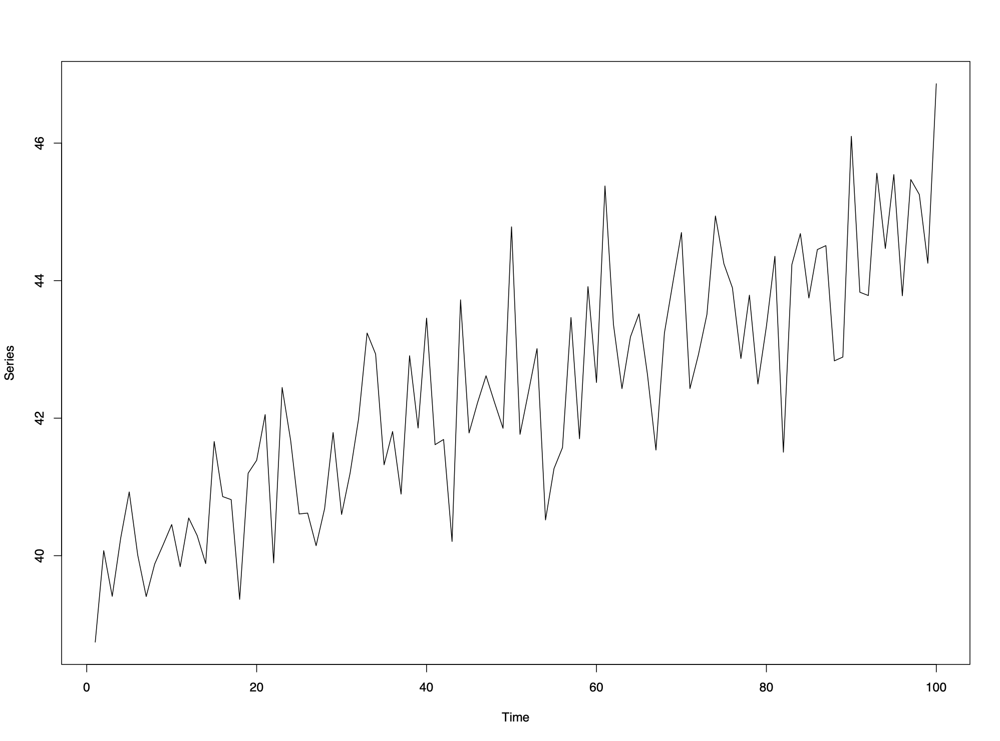
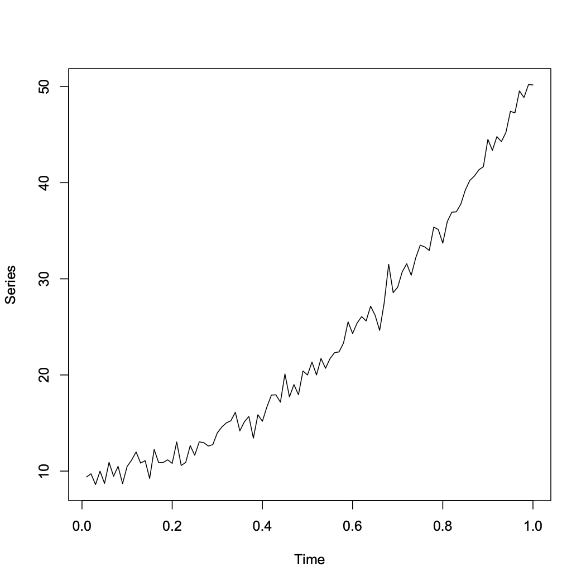
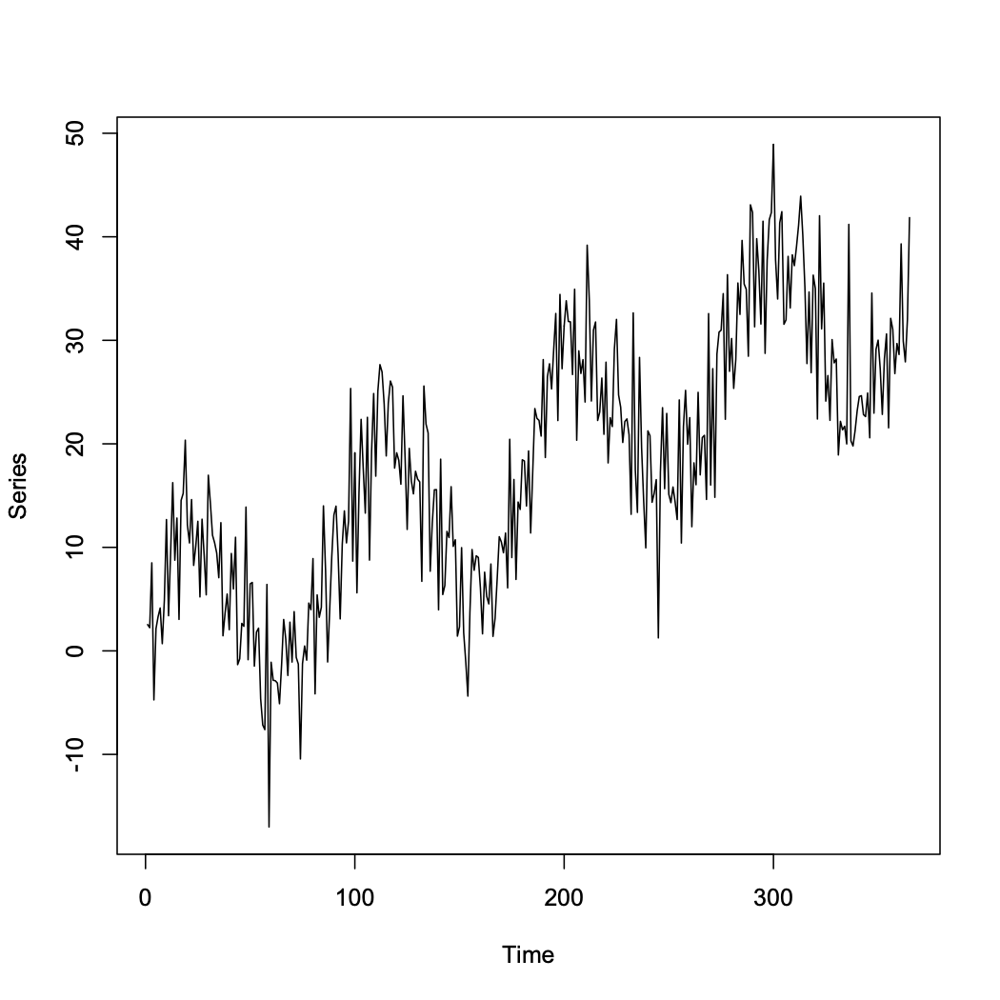
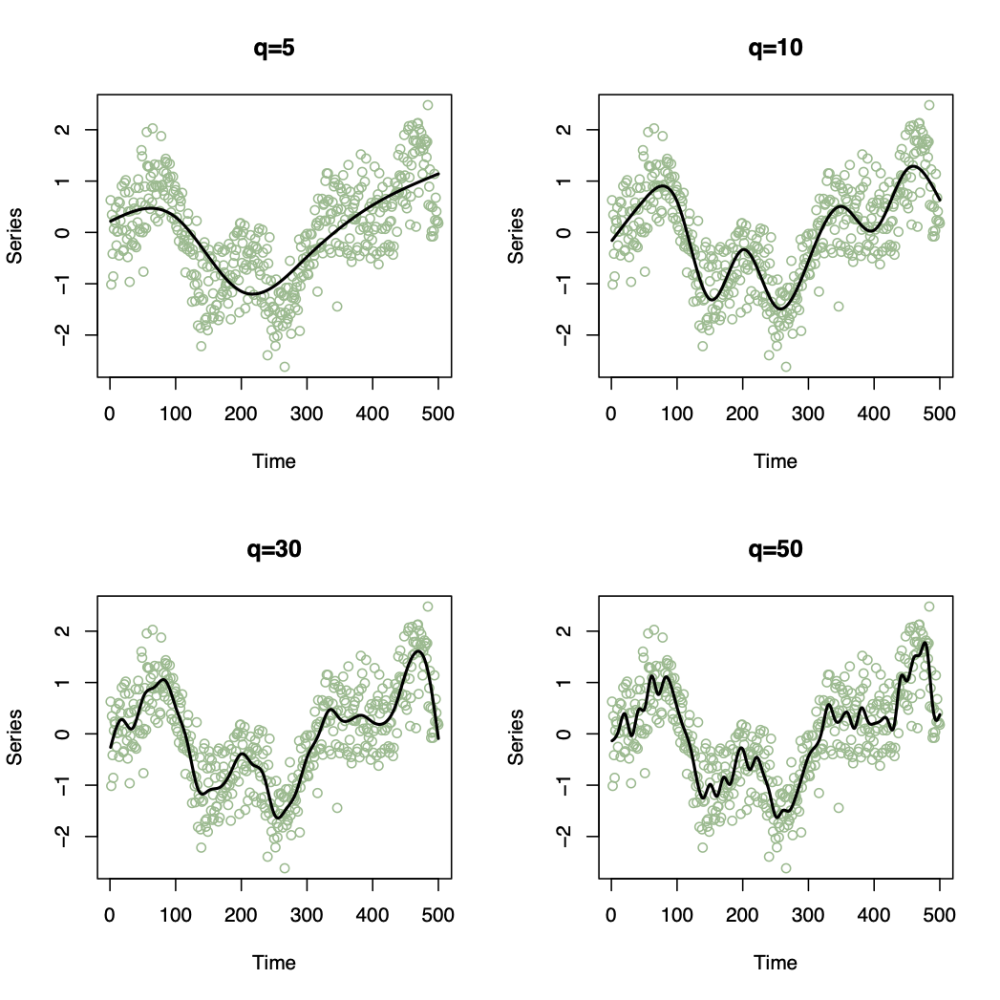

```{r setup, include=FALSE} 
knitr::opts_chunk$set(warning = FALSE, message = FALSE) 
```

# Chapter 2: Modelling trends and seasonal patterns

1. Trend and Seasonality can be the main interests

2. Need to remove trend and seasonality to determine short-term correlation

For this chapter, assume additivity: $X_t=m_t+s_t+e_t$ (Refer to Ch.1)

First is to estimate the trend and seasonal variation $\hat m_t+\hat s_t$, then calculate the residual series $e_t^*=X_t-\hat m_t-\hat s_t$

3 of the most common methods for modelling trend and seasonality are described here.

## Method 1: Regression

$$m_t+s_t=\beta_0+\beta_1z_{t1}+...+\beta_pz_{tp}$$
Cons: OLS estimation assumes observations are independent.
Pros: Remove trend to later model the correlation by a stationary time series process

$z_{tn}$ are often functions of time

### Examples

#### Linear trend in time but no seasonal variation:


Trend can be modelled by $X_t=\beta_0+\beta_1t+e_t$ and using series $e_t$ to analyze short-term correlation

#### Quadratic trend in time but no seasonal variation:


Trend can be modeled by $X_t=\beta_0+\beta_1t+\beta_2t^2+e_t$ 

#### Seasonal pattern in time and a linear trend with 365 data points:


Trend and Seasonality can be modeled by $X_t=\beta_0+\beta_1t+\beta_2sin(8\pi t/365)+e_t$ 

### Other common models

#### Other Covariates
$$m_t=\beta+0+\beta_1\alpha_t$$

#### Polynomials
$$m_t=\beta+0+\beta_1t+\beta_qt^q$$
Higher $q$, more flexible the trend

#### Harmonics
$$s_t=\beta_0+\sum_{i=1}^q\beta_{1i}sin(w_it)+\beta_{2i}cos(w_it)$$
Harmonics assume the seasonal pattern has a regular shape, i.e. the height of the peaks is the same as the depth of the troughs.

#### Seasonal Factors

Assuming the seasonal pattern repeats itself every d time points, a less restrictive approach is to model it as:

$$s_{t}=\left\{\begin{array}{cc}0&\mbox{if}~t=1, d+1, 2d+2,\ldots\\
  s_{2}&\mbox{if}~t=2, d+2, 2d+2,\ldots\\
  \vdots&\vdots\\
  s_{d}&\mbox{if}~t=d, 2d, 3d,\ldots\\\end{array}\right.$$
  
This model can be fitted by creating $d - 1$ dummy variables in the design matrix, that contain 1’s and 0’s.

#### Natural cubic splines (More flexible)

$$m_{t}+s_{t}=\beta_{0}+\sum_{i=1}^{q}\beta_{i}B_{i}(t)$$


## Method 2: Moving Average Smoothing

A Moving average smoother estimates the trend and seasonal variation at time t by averaging the current observation and the q either side

$$\hat{m}_{t}+\hat{s}_{t}=\frac{1}{2q+1}\sum_{j=-q}^{q}x_{t-j}$$
Note: Shorten length of time series by $2q$, therefore if the trend is smooth and $q$ is large, the series shortens significantly.

## Method 3: Differencing

### Remove Trends

#### First order difference operator $\nabla$:

$$\nabla X_{t}=X_{t}-X_{t-1}=(1-B)X_{t}$$

where $B$ is the Backshift operator defined as $BX_{t}=X_{t-1}$

#### General order difference operator $\nabla^q$

$$\nabla^{q} X_{t}=\nabla[\nabla^{q-1}X_{t}]$$
$$B^{q}X_{t}=X_{t-q}$$
Notes:
1. A polynomial trend of order $q$ can be removed by $q^{th}$ order differencing
2. Typically only first or second order differencing is required
3. Shortens length by $q$
4. Differencing won't allow to estimate the trend but only to remove it.

### Remove Seasonality

The seasonal difference of order $d$ is the operator $\nabla_d$ given by
$$\nabla_{d} X_{t}=X_{t}-X_{t-d}=(1-B^{d})X_{t}$$
Notes:
1. Trial and Error approach
2. No point differencing twice if once is adequate
3. Differencing increases the variance

## Choosing a smoothing parameter

### Simplicity

Simple statistical models are preferred since they are easier to make inferences from.

### Objective criteria (AIC & BIC)

Assumptions: 
1. Normally distributed observations
2. $m_{t}+s_{t}=\textbf{z}_{t}^\top \boldsymbol{\beta}$

where $\textbf{z}_{t}^\top$ is a vector of $q-1$ known covariates and a one to represent the intercept term

#### Akaike’s Information Criterion (AIC) 

$$\mbox{AIC}(q)=-2\mathcal{L}(\mathbf{x}|\hat{\boldsymbol{\beta}}) + 2q$$

#### Bayesian Information Criterion (BIC) 

$$\mbox{BIC}(q)=-2\mathcal{L}(\mathbf{x}|\hat{\boldsymbol{\beta}}) + \ln(n)q$$

where $\mathcal{L}(\mathbf{x}|\hat{\boldsymbol{\beta}})$ is the maximised log likelihood function of $\mathbf{x}$

Both criteria tradeoff the fit to the data against simplicity (i.e. few parameters), and small values suggest a good fit to the data.

# Chapter 2 Lab

## Model choice and Residual analysis

AIC and BIC are great measures for fit of models:

$$ average(observed-predicted)^2+k(p+q)$$
The smaller these measures are, the better the prediction. 

sarima() fucntion returns 4 graphs. Given we want the model to predict most of the observed data, and the residuals are just white noise, these 4 tools can help us identify whether residuals are just white noise:

1. Standardized residuals: does it look like white noise?
2. Sample ACF of residuals: no statistically significant ACF (everything within the blue lines)
3. Normal Q-Q plot: it should look like a line with a few outliers 
4. Q-statistic p-values: all p-values should be above the line

Finding the right model most of the time are through trials and errors starting with some ideas based off what we know about the data. 

## Data Example: Annual Varve Series

Sedimentary deposits from one location in Massachusetts for 634 years, beginning nearly 12,000 years ago. Loaded from library astsa

```{r}
library(astsa)
ts.plot(varve)
dl_varve <- diff(log(varve))
ts.plot(dl_varve)
```

From the time series plot, it does not look like the data has a obvious linear trend, therefore first order differencing is most appropriate to tranform the data into a stationary process. It looks like it has a constant mean but moving average, suggesting MA(q) models might be appropriate. We will take a look at the ACF and PACF plots to further access: 

```{r, echo=TRUE}
acf2(varve)
```
The correlograms on the time plot of varve did not tell us a great deal here, which is expected. Now we will look at the ACF and PACF of the first order difference series:

```{r, echo=TRUE}
acf2(dl_varve)
```

Based on ACF, MA(1) model might be appropriate. Based on PACF, AR(5) might be appropriate, however, I would start with smallest value of p for simplicity of the model


```{r echo = TRUE}
# Fit an MA(1) to dl_varve.   
sarima(dl_varve, p = 0, d = 0, q = 1)
model_ma1 <- arima(dl_varve, order = c(0,0,1))
AIC(model_ma1)
BIC(model_ma1)
```

```{r echo = TRUE}
# Fit an MA(2) to dl_varve. Improvement?
sarima(dl_varve, p = 0, d = 0, q = 2)
model_ma2 <- arima(dl_varve, order = c(0,0,2))
AIC(model_ma2)
BIC(model_ma2)
```

```{r echo = TRUE}
# Fit an ARMA(1,1) to dl_varve. Improvement?
sarima(dl_varve, p = 1, d = 0, q = 1)
model_arma11 <- arima(dl_varve, order = c(1,0,1))
AIC(model_arma11)
BIC(model_arma11)
```

```{r echo = TRUE}
# Fit an ARMA(2,1) to dl_varve. Improvement?
sarima(dl_varve, p = 2, d = 0, q = 1)
model_arma21 <- arima(dl_varve, order = c(2,0,1))
AIC(model_arma21)
BIC(model_arma21)
```

Here we tried fitting ARIMA(0,0,1), ARIMA(0,0,2), ARIMA(1,0,1), and ARIMA(2,0,1), which are MA(1), MA(2), ARMA(1,1), and ARMA(2,1), respectively. ARMA(1,1) and ARMA(2,1) are better options than MA(1) and MA(2) based on the AIC and BIC and other statistics tell that the residuals resemble more of white noise. 