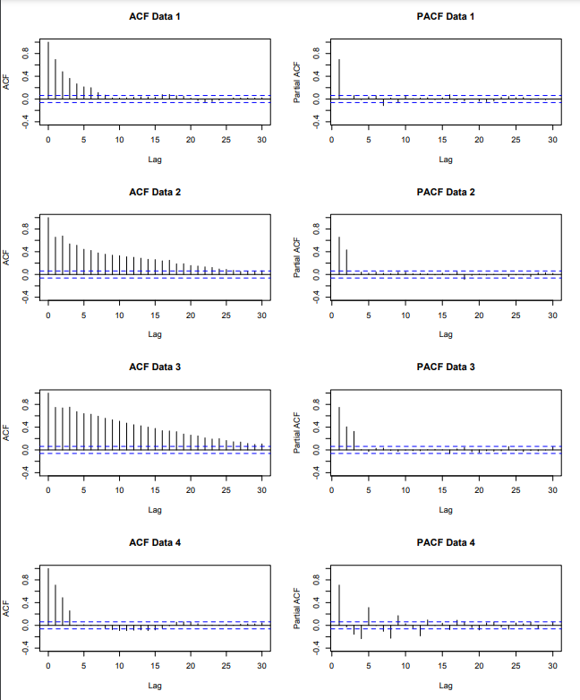

```{r setup, include=FALSE} 
knitr::opts_chunk$set(warning = FALSE, message = FALSE) 
```

# Chapter 3: Autoregressive processes

$Z_t$ is purely random with mean zero and variance $\sigma_z^2$ 

## Definition

An Autoregressive process of order $p$, denoted $AR(p)$, is given by
$$X_{t}=\alpha_{1}X_{t-1}+\ldots+\alpha_{p}X_{t-p}+Z_{t}$$
Where we assume $X_{0}=X_{-1}=\ldots=X_{1-p}=0$

Essentially regress $X_t$ to its own past values

## First order Autoregressive process

An $AR(1)$ process is given by
$$X_{t}=\alpha X_{t-1}+Z_{t}$$

### Mean

$$E(AR(1))=0$$

### Variance

If $|\alpha|\geq1$ then $Var[X_t]=\infty$
If $|\alpha|\lt1$ then $\alpha^2\lt1$, and:


$$\sum_{j=0}^{\infty}\alpha^{2j}=1+\alpha^{2}+\alpha^{4}+\alpha^{6}+\ldots~=~\frac{1}{1-\alpha^{2}}$$

So we have: 

$$\mathrm{Var}[X_{t}]=\sigma_{z}^{2}\sum_{j=0}^{\infty}\alpha^{2j}=\frac{\sigma_{z}^{2}}{1-\alpha^{2}}
$$

### Examples

```{r echo=FALSE, message=FALSE, warning=FALSE, paged.print=FALSE}
# Simulate AR(1) data
n <- 100
sd <- 10
data1 <- arima.sim(model = list(ar = -0.8), n = n, sd = sd)
data2 <- arima.sim(model = list(ar = 0.01), n = n, sd = sd)
data3 <- arima.sim(model = list(ar = 0.4), n = n, sd = sd)
data4 <- arima.sim(model = list(ar = 0.8), n = n, sd = sd)

# Plot the data
par(mfrow = c(4, 2))
plot(data1, main = "alpha = -0.8")
acf(data1, main = "alpha = -0.8")
plot(data2, main = "alpha = 0.01")
acf(data2, main = "alpha = 0.01")
plot(data3, main = "alpha = 0.3")
acf(data3, main = "alpha = 0.3")
plot(data4, main = "alpha = 0.8")
acf(data4, main = "alpha = 0.8")
```

## $AR(p)$ process

is given by
$$X_{t}=\alpha_{1}X_{t-1}+\ldots+\alpha_{p}X_{t-p}+Z_{t}
$$

$Z_t$ can be written as:

$$\begin{eqnarray}
X_{t}&=&\alpha_{1}X_{t-1}+\ldots+\alpha_{p}X_{t-p}+Z_{t}\nonumber\\
X_{t}-\alpha_{1}X_{t-1}-\ldots-\alpha_{p}X_{t-p}&=&Z_{t}\nonumber\\
(1-\alpha_{1}B-\alpha_{2}B^{2}-\ldots-\alpha_{p}B^{p})X_{t}&=&Z_{t}\nonumber\\
\phi(B)X_{t}&=&Z_{t}\nonumber
\end{eqnarray}
$$

where $B$ is the backshift operator

### Mean

$$E[AP(p)] = 0$$

### Stationarity

We calculate the variance and autocorrelation function conditional on the process being stationary. The following theorem tells us when an AR(p) process is stationary.

Theorem

AR(p) written as $\phi(B)X_{t}=Z_{t}$
where $\phi(B)$ is the characteristic polynomial $\phi(B)=1-\alpha_{1}B-\alpha_{2}B^{2}-\ldots-\alpha_{p}B^{p}$

Then the process is stationary if the roots of the characteristic equation
$$\phi(B)=1-\alpha_{1}B-\alpha_{2}B^{2}-\ldots-\alpha_{p}B^{p}=0$$
have modulus greater than 1, i.e. they lie outside the unit circle. Here we consider $B$ as the variable of the polynominal equation

### Variance

$$\mathrm{Var}[X_{t}]=\sigma^{2}_{z}+\sum_{\tau=1}^{p}\alpha_{\tau}\gamma_{\tau}
$$

### Autocorrelation Function

Using Yule-Walker equation:

$$\rho_{\tau}=\alpha_{1}\rho_{\tau-1}+\ldots+\alpha_{p}\rho_{\tau-p}$$
Examples for $\tau = 1$ and $\tau = 2$:

$$\rho_{1}=\frac{\alpha_{1}}{1-\alpha_{2}}.$$

$$\rho_{2}=\alpha_{1}\rho_{1}+\alpha_{2}\rho_{0}=\frac{\alpha_{1}^{2}}{1-\alpha_{2}}+\alpha_{2}$$
Note: as $\tau$ increases the function gets more complex algebraically. Same thing with p increases in AR(p)

## When and how to use AR(p) model

Realisations from the following AR(1) and AR(2) models:

$$X_t=0.6X_{t-1}+Z_t$$
$$X_t=0.75X_{t-1}-0.125X_{t-2}+Z_t$$

```{r}
# Simulate AR(1) and AR(2) data
n <- 100
sd <- 10
data1 <- arima.sim(model = list(ar = 0.6), n = n, sd = sd)
data2 <- arima.sim(model = list(ar = c(0.75, -0.125)), n = n, sd = sd)

# Plot the correlogram and time plot
par(mfrow = c(2, 2))
plot(data1, main = "AR(1) data")
acf(data1, main = "AR(1) data")
plot(data2, main = "AR(2) data")
acf(data2, main = "AR(2) data")
```
The ACF are the same. It will be better to look at the correlogram of the residuals to see if the residuals resemble a purely random process. If there is still residual correlation, increase $p$ by one and re-fit the model and repeat. However, this is not a good method if AR(p) isn't a suitable model at the first place.

### Definition of PACF

The partial autocorrelation function (PACF) at lag $τ$ is equal to the estimated lag $τ$ coefficient $\hat \alpha_{\tau}$, obtained when fitting an AR($τ$) model to a data set. It is denoted by $π_τ$, and represents the excess correlation in the time series that has not been accounted for by the $τ-1$ smaller lags.

The partial autocorrelation function allows us to determine an appropriate AR(p) process for a given data set. This is because if the data do come from an AR(p) process then: 

$$\pi_{\tau} = \left\{\begin{array}{cc}\mbox{positive}&\tau\leq p\\0&\tau>p\end{array}\right.$$

This is because by definition, PACF is only measuring the direct correlation of the data with lag $\tau$. The AR(p) model does not factor in lag bigger than p, making the coefficient of those would be 0. 

Therefore, to choose the order of an AR(p) process, plot the PACF and choose p as the smallest value that is significantly different from zero.

#### Example

Looking at PACF, Data 1 uses AR(1) process, Data 2 uses AR(2), Data 3 uses AR(3), Data 4 uses AR(12)



# Chapter 3 Lab

## Autoregressive model (AR) 

AR(p) process is correlation with lagged values of the data itself. 

$$ X_t-\mu = \alpha \cdot (X_{t-1}-\mu)+Noise_t$$

Some simulation examples down below. Note how the coefficent $\phi$ affects the look of the graph:

```{r echo=TRUE}
x <- arima.sim(model = list(ar = 0.5), n = 100)

# Simulate an AR model with 0.9 slope
y <- arima.sim(model = list(ar = 0.9), n = 100)

# Simulate an AR model with -0.75 slope
z <- arima.sim(model = list(ar = -0.75), n = 100)

plot.ts(cbind(x, y, z))
```
AR(1) model with slope $\alpha=0.9$ creates a obvious trend while the negative slope creates a zic-zac pattern.

```{r echo=TRUE}
par(mfrow = c(3,1))

# Plot your simulated data
acf(x)
acf(y)
acf(z)
```
The ACF plots tell a lot about each time plot:

1. Strong short-term positive correlation in early lags (1 and 2)

2. Strong short-term positive correlation in early lags up to lag of 5 

3. Strong short-term negative correlation in early lags up to lag of 5

The PACF will tell us what AR(p) model would be appropriate for fitting this data

```{r echo=TRUE}
par(mfrow = c(3,1))

# Plot your simulated data
pacf(x)
pacf(y)
pacf(z)
```

The PACF plots tell us that a AR(1) model would be appropriate for all 3 data. This is expected since we used AR(1) models to generate these data. 

## Chicken Price

## Chicken price

```{r}
library(astsa)

# Plot differenced chicken
plot(diff(chicken)) 

# Plot P/ACF pair of differenced data to lag 60
acf2(diff(chicken), max.lag = 60)

# Fit ARIMA(2,1,0) to chicken - not so good
sarima(chicken, p = 2, d = 1, q = 0)

# Fit SARIMA(2,1,0,1,0,0,12) to chicken - that works
sarima(chicken, p = 2, d = 1, q = 0, P = 1, D = 0, Q = 0, S = 12)

```

## Unemployment

```{r}
plot(unemp)
d_unemp <- diff(unemp)

plot(d_unemp)

# Plot seasonal differenced diff_unemp
dd_unemp <- diff(d_unemp, lag = 12)   
plot(dd_unemp)

# Plot P/ACF pair of the fully differenced data to lag 60
dd_unemp <- diff(diff(unemp), lag = 12)
acf2(dd_unemp, max.lag = 60)

# Fit an appropriate model
sarima(unemp, p = 2, d = 1, q = 0, P = 0, D = 1, Q = 1, S = 12)
```