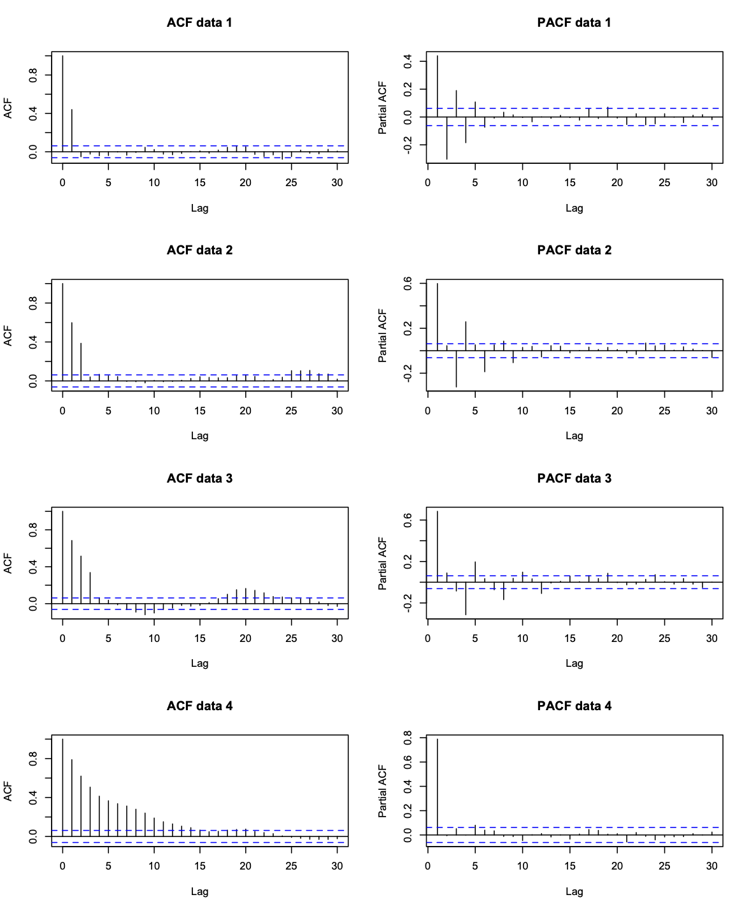

```{r setup, include=FALSE} 
knitr::opts_chunk$set(warning = FALSE, message = FALSE) 
```

# Chapter 4: Moving Average processes

## Definition

A Moving Average process of order $q$, denoted MA($q$), is given by

$$X_{t}=\lambda_{0}Z_{t}+\lambda_{1}Z_{t-1}+\ldots+\lambda_{q}Z_{t-q}$$

where $\lambda_0=1$

## Mean and Variance

Mean of any MA($q$) process:  $E[X_t]=0$

Variance:
$$X_{t}=\sigma^{2}_{z}\left[1+\sum_{j=1}^{q}\lambda_{j}^{2}\right]$$

## Autocorrelation functions

Autocovariance function: 

$$\gamma_{\tau}=\mathrm{Cov}[X_{t},X_{t+\tau}]=\left\{\begin{array}{cc}\sigma_{z}^{2}\sum_{j=0}^{q-\tau}\lambda_{j}\lambda_{j+\tau}&\mbox{if}~\tau=0,1,\ldots,q\\
0&\tau>q\\
\end{array}\right.$$

and autocorrelation function:

$$\rho_{\tau}=\mathrm{Corr}[X_{t},X_{t+\tau}]=\left\{\begin{array}{cc}1&\mbox{if}~\tau=0\\
\frac{\sum_{j=0}^{q-\tau}\lambda_{j}\lambda_{j+\tau}}{\sum_{j=0}^{q}\lambda_{j}^{2}}&\mbox{if}~\tau=1,\ldots,q\\
0&\tau>q\\
\end{array}\right.$$

where $\lambda_0=1$

Notes:

1. The mean and variance of any MA($q$) process are finite and constant, while the autocorrelation function is finite and does not depend on $t$. Therefore any MA($q$) is weakly stationary.

2. The autocorrelation function of an MA($q$) process is positive at lags $1,…,q$ and zero for any lag greater than $q$. This gives us a method for detecting whether an MA($q$) process is an appropriate model for a given data set.

### Examples: 

Consider the MA(1) process: $X_t = Z_t + \lambda Z_{t-1}$. Its variance is given by
$$\begin{eqnarray}
\mathrm{Var}[X_{t}]&=&\mathrm{Var}[Z_{t}+\lambda Z_{t-1}]\nonumber\\
&=&\sigma^{2}_{z}(1+\lambda^{2}).\nonumber
\end{eqnarray}$$

Its lag one autocovariance is given by

$$\begin{eqnarray}
\mathrm{Cov}[X_{t},X_{t+1}]&=&\mathrm{Cov}[Z_{t}+\lambda Z_{t-1},~Z_{t+1}+\lambda Z_{t}]\nonumber\\
&=&\mathrm{Cov}[Z_{t},~Z_{t+1}]+\lambda \mathrm{Cov}[Z_{t},~Z_{t}]+\lambda \mathrm{Cov}[Z_{t-1},~Z_{t+1}]+\lambda^{2}\mathrm{Cov}[Z_{t-1},~Z_{t}]\nonumber\\
&=&\lambda \sigma_{z}^{2}\nonumber
\end{eqnarray}$$

lag 2 autocovariance is given by

$$\begin{eqnarray}
\mathrm{Cov}[X_{t},X_{t+2}]&=&\mathrm{Cov}[Z_{t}+\lambda Z_{t-1},~Z_{t+2}+\lambda Z_{t+1}]\nonumber\\
&=&\mathrm{Cov}[Z_{t},~Z_{t+2}]+\lambda \mathrm{Cov}[Z_{t},~Z_{t+1}]+\lambda \mathrm{Cov}[Z_{t-1},~Z_{t+2}]+\lambda^{2}\mathrm{Cov}[Z_{t-1},~Z_{t+1}]\nonumber\\
&=&0.\nonumber
\end{eqnarray}$$

the autocorrelation function is given by

$$\rho_{\tau}=\left\{\begin{array}{cc}1&\mbox{if}~\tau=0\\
\frac{\lambda}{1+\lambda^{2}}&\mbox{if}~\tau=1\\
0&\tau>1\\
\end{array}\right.$$

### Another example

Consider the MA(2) process $X_t = Z_t +0.9Z_{t-1}+0.5Z_{t-2}$. Its variance is given by

$$\begin{eqnarray}
\mathrm{Var}[X_{t}]&=&\mathrm{Var}[Z_{t}+0.9 Z_{t-1} + 0.5Z_{t-2}]\nonumber\\
&=&\sigma^{2}_{z}(1+0.81 + 0.25)\nonumber\\
&=&2.06\sigma^{2}_{z}.\nonumber
\end{eqnarray}
$$

Its lag one autocovariance is given by

$$\begin{eqnarray}
\mathrm{Cov}[X_{t},X_{t+1}]&=&\mathrm{Cov}[Z_{t}+0.9 Z_{t-1}+0.5Z_{t-2},~Z_{t+1}+0.9 Z_{t} +0.5Z_{t-1}]\nonumber\\
&=&0.9 \mathrm{Cov}[Z_{t},~Z_{t}]+0.45 \mathrm{Cov}[Z_{t-1},~Z_{t-1}]\nonumber\\
&=&1.35\sigma_{z}^{2}\nonumber
\end{eqnarray}
$$

Its lag 2 autocovariance is given by

$$\begin{eqnarray}
\mathrm{Cov}[X_{t},X_{t+2}]&=&\mathrm{Cov}[Z_{t}+0.9 Z_{t-1}+ 0.5Z_{t-2},~Z_{t+2}+0.9 Z_{t+1}+ 0.5Z_{t}]\nonumber\\
&=&0.5\mathrm{Cov}[Z_{t},~Z_{t}]\nonumber\\
&=&0.5\sigma^{2}_{z}.\nonumber
\end{eqnarray}
$$
Therefore the autocovariance function is given by

$$\gamma_{\tau}=\left\{\begin{array}{cc}2.06\sigma^{2}_{z}&\mbox{if}~\tau=0\\
1.35\sigma^{2}_{z}&\mbox{if}~\tau=1\\
0.5\sigma^{2}_{z}&\mbox{if}~\tau=2\\
0&\tau>2\\
\end{array}\right.
$$

while the autocorrelation function is given by

$$\rho_{\tau}=\left\{\begin{array}{cc}1&\mbox{if}~\tau=0\\
0.655&\mbox{if}~\tau=1\\
0.243&\mbox{if}~\tau=2\\
0&\tau>2\\
\end{array}\right.
$$

## Invertibility

Therefore, given a set of sample autocorrelation functions $\hat{\boldsymbol{\rho}}_p$ calculated from a time series, there is a unique set of parameters $\hat \alpha that best fit the data within the class of stationary AR(p) processes. For an MA(q) process the corresponding relationship is given by

$$\rho_{\tau}=\mathrm{Corr}[X_{t},X_{t+\tau}]=\left\{\begin{array}{cc}1&\mbox{if}~\tau=0\\
\frac{\sum_{j=0}^{q-\tau}\lambda_{j}\lambda_{j+\tau}}{\sum_{j=0}^{q}\lambda_{j}^{2}}&\mbox{if}~\tau=1,\ldots,q\\
0&\tau>q\\
\end{array}\right.
$$

which is a set of non-linear equations in $\boldsymbol{\lambda}=(\lambda_{1},\ldots,\lambda_{q})$. Therefore for a given autocorrelation function $\boldsymbol{\rho}_{q}$ there may exist more than one set of parameters $\lambda$ that satisfy the above equation.

### Inveritibility Theorem

The MA(q) process

$$\begin{eqnarray}
X_{t}&=&Z_{t}+\lambda_{1}Z_{t-1}+\ldots+\lambda_{q}Z_{t-q}\nonumber\\
&=&(1+\lambda_{1}B+\ldots+\lambda_{q}B^{q})Z_{t}\nonumber\nonumber\\
&=&\theta(B)Z_{t}\nonumber
\end{eqnarray}
$$

is invertible if and only if the roots of the characteristic polynomial $\theta (B)$ have modulus greater than one and hence lie outside the unit circle.

#### Example of invertibility

$$X_{t}=Z_{t} + 4.25Z_{t-1} + Z_{t-2}$$

Characteristic polynomial is given by $\theta(B)~=~1 + 4.25B + B^{2}$

Solving $1 + 4.25B + B^{2}=0$ gives:

$$\begin{eqnarray}
\mbox{roots}&=&\frac{-4.25\pm\sqrt{(4.25)^2-4\times1\times1}}{2\times 1}\nonumber\\
\mbox{roots}&=&\frac{-4.25\pm3.75}{2}\nonumber\\
\mbox{roots}&=&-0.25\mbox{ and }-4\nonumber
\end{eqnarray}
$$

Therefore as one of the routes has modulus less than one the process is not invertible.

## MA Model Identification

Determine if a MA model is appropriate and which order process should we use using the autocorrelation function ACF:

$$\rho_{\tau}=\mathrm{Corr}[X_{t},X_{t+\tau}]=\left\{\begin{array}{cc}1&\mbox{if}~\tau=0\\
\frac{\sum_{j=0}^{q-\tau}\lambda_{j}\lambda_{j+\tau}}{\sum_{j=0}^{q}\lambda_{j}^{2}}&\mbox{if}~\tau=1,\ldots,q\\
0&\tau>q\\
\end{array}\right.
$$

This function is non-zero for $\tau \le q$ and zero for $\tau >q$

Note
The autocorrelation function (ACF) tells us whether an MA(q) process is appropriate while the partial autocorrelation function (PACF) suggests whether an AR(p) process is appropriate. Therefore for a given time series, both should be plotted to show which process would be a good model.

### Example

Looking at ACF, Data 1 uses MA(1) process, Data 2 uses MA(2), Data 3 uses MA(3), Data 4 uses MA(12)



## MA parameter estimation

Conditional least squares: Consider the MA(1) model $X_{t}=\mu+Z_{t}+\lambda Z_{t-1}$, where $\mathrm{Var}[Z_{t}]=\sigma^{2}_{z}$. The conditional least squares algorithm works as follows:

1. Select starting values for $\mu$ and $\lambda$,

$$\tilde{\mu}=\frac{1}{n}\sum_{t=1}^{n}x_{t}\hspace{1cm}\mbox{and by solving}\hspace{1cm}\hat{\rho}_{1}=\frac{\tilde{\lambda}}{1+\tilde{\lambda}^{2}}
$$

2. Calculate the conditional residual sum of squares

$$S(\tilde{\mu},\tilde{\lambda})=\sum_{t=1}^{n}[x_{t}-\tilde{\mu}-\tilde{\lambda}Z_{t-1}]^{2}
$$

Where $Z_0=0$ and $_Z_t$ is calculated recursively using

$$Z_{t}=x_{t}-\tilde{\mu}-\tilde{\lambda}Z_{t-1}
$$

3. Repeat step 2 for a range of values of $(\mu, \lambda)$ that are close to the initial estimates in step 1. Then determine the estimates $(\hat{\mu},\hat{\lambda})$ as the values that mimimize $S(\tilde{\mu},\tilde{\lambda})$ over all those values considered

4. Using the fact that the variance of an MA(1) process is $\mathrm{Var}[X_{t}]=\sigma^{2}_{z}(1+\lambda^{2})$, we obtain that

$$\hat{\sigma}^{2}_{z}=\frac{\hat{\sigma}^{2}}{(1+\hat{\lambda}^{2})}
$$

where $\hat \sigma^2$ is the overall variance of the process.

## MA Example


```{r}
# Generate MA(3) data with a quadratic trend
time <- 1:200
n <- 200
sd <- 10
data.ar <- arima.sim(model = list(ma = c(0.6, 0.3, 0.6)), n = n, sd = sd)
data <- data.ar + 30 + 0.05 * time + 0.004*time^2
par(mfrow = c(2, 1))
plot(time, data, type = "l", main = "Raw data plot")
acf(data, main = "Sample autocorrelation function")
```

From looking at the time plot and correlogram the data appear to have a quadratic trend, which we remove before trying to model the correlation. Fitting $m_{t}=\beta_{0}+\beta_{1}t+\beta_{2}t^{2}$ gives the follwing residual series:

```{r}
# Remove the trend
time2 <- time^2
linear.model <- lm(data ~ time+time2)
residual.series <- data - linear.model$fitted.values
par(mfrow = c(3,1))
plot(residual.series, main = "Residual series")
acf(residual.series, main = "ACF of Residual series")
pacf(residual.series, main = "PACF of Residual series")
```

Time plot suggests stationary while ACF suggest an MA(3) process is appropriate. Note that the PACF doesn't tell us a lot here. 

Finally we fit a MA(3) model using function arima() in R

```{r}
# Fit an MA(3) model to the data
model.ma <- arima(residual.series, order = c(0, 0, 3))
model.ma

arima(x = residual.series, order = c(0, 0, 3))

par(mfrow = c(3, 1))
plot(model.ma$residuals, main = "MA(3) Residual series")
acf(model.ma$residuals, main = "MA(3) ACF of Residual series")
pacf(model.ma$residuals, main = "MA(3) PACF of Residual series")
```

Residuals look independent (resemble white noise), so the model below is appropriate

$$X_{t}=\beta_{0}+\beta_{1}t+\beta_{2}t^{2}+\lambda_{1}Z_{t-1}+\lambda_{2}Z_{t-2}+\lambda_{3}Z_{t-3}+Z_{t}.
$$

# Chapter 4 Lab

## Moving Average model (MA)

$$ X_t = \mu + Noise_t + \theta \cdot(Noise_{t-1})$$
Regression on today's data using yesterday's noise.

```{r echo=TRUE}
# Generate MA model with slope 0.5
x <- arima.sim(model = list(ma = 0.5), n = 100)

# Generate MA model with slope 0.9
y <- arima.sim(model = list(ma = 0.9), n = 100)

# Generate MA model with slope -0.5
z <- arima.sim(model = list(ma = -0.5), n = 100)

# Plot all three models together
plot.ts(cbind(x, y, z))

par(mfrow = c(3, 1))
# Calculate the ACF 
acf(x)
acf(y)
acf(z)
```