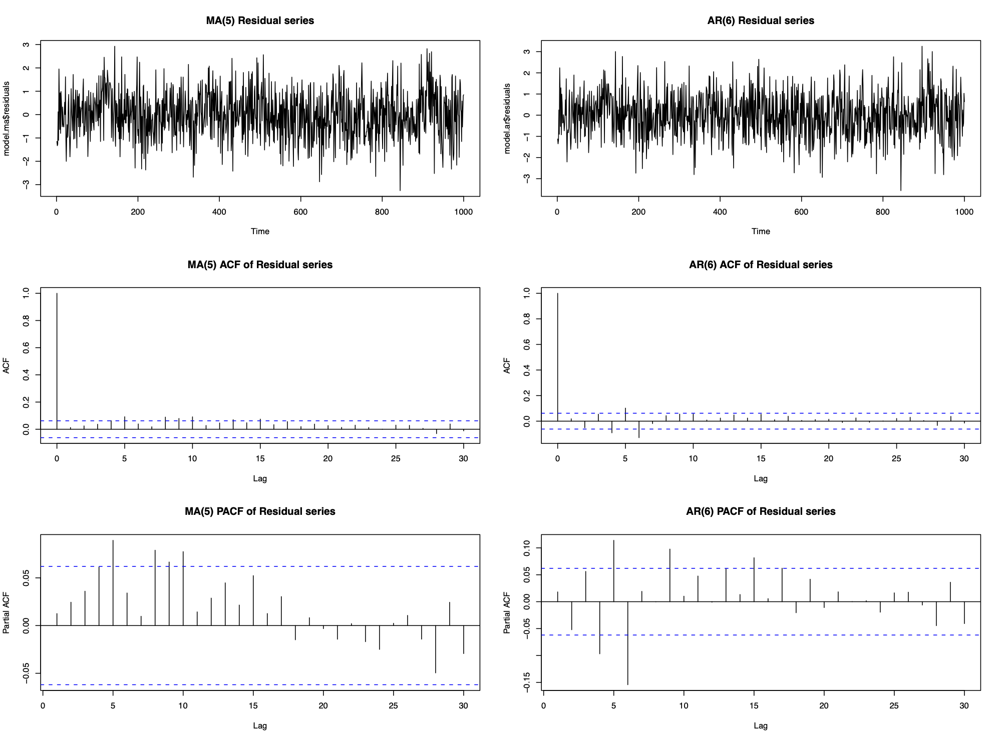
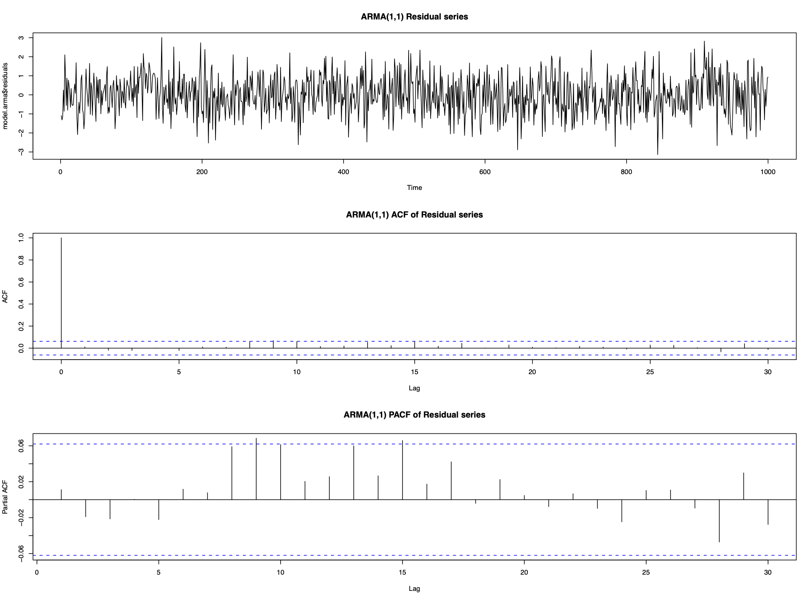

```{r setup, include=FALSE} 
knitr::opts_chunk$set(warning = FALSE, message = FALSE) 
```

# Chapter 5: More general time series processes

For most data sets the AR and MA models will be adequate to represent short-term correlation, with autoregressive correlation occurring more often than moving average. However, occasionally you may meet data that are not well represented by either of these time series processes, an example of which is shown below. 

Example: 

Consider the following data which appear to be stationary but contain short-term correlation.


The ACF and PACF suggest that neither an AR nor an MA process is appropriate, but as these are the only models we know, we fit them to the data to see how well they remove the short-term correlation. We chose the order (p and q) as the lowest values that removed the majority of the correlation, which resulted in an AR(6) model or an MA(5) model:


Neither fits the data perfectly as the residual series isn't white noise. Both also used high order processess (p=6 and q=5) which include a relatively large number of parameters. This emphasizes two points:

1. Even if the correlation structure does not look like an AR(p) or an MA(q) process, fitting these models with large enough p and q will remove the majority of the correlation. Therefore it is better to model correlation with the wrong time series process than not to model it at all.

2. However, AR(p) and MA(q) processes are not always appropriate models for short-term correlation

## ARMA model

An Autoregressive Moving Average process of order (p,q) denoted ARMA(p,q) is given by

$$\begin{eqnarray}
X_{t}&=&\alpha_{1}X_{t-1}+\ldots+\alpha_{p}X_{t-p} + Z_{t} + \lambda_{1}Z_{t-1}+\ldots+\lambda_{q}Z_{t-q}\nonumber\\
&=&\sum_{j=1}^{p}\alpha_{j}X_{t-j}+\sum_{j=1}^{q}\lambda_{j}Z_{t-j} + Z_{t}\nonumber
\end{eqnarray}
$$

Using Backshift operator the model can be rewritten as

$$\phi(B)X_{t} = \theta(B)Z_{t}$$

Example:

The data in the first example can be modelled by an ARMA(1,1) process

$$X_{t}=\alpha X_{t-1}+\lambda Z_{t-1}+Z_{t}
$$




### Mean of ARMA(p,q) process

$$E[X_t] = 0$$

### Variance and autocorrelation function

Variance:

$$\begin{eqnarray}
\mathrm{Var}[X_{t}]&=&\alpha \gamma_{1}+\lambda (\alpha\sigma^{2}_{z} + \lambda\sigma^{2}_{z})+\sigma^{2}_{z}\nonumber\\
&=&\alpha \gamma_{1}+\sigma^{2}_{z}(\lambda^{2}+\lambda\alpha+1).\nonumber
\end{eqnarray}
$$

Autocorrelation function:

$$\rho_{\tau}=\alpha \rho_{\tau-1}$$

### Stationarity and Invertibility

We know that MA(q) process is always stationary and AR(p) process is always invertible. Therefore an ARMA(p,q) process

1. is stationary if the AR(p) part is stationary, i.e., if the roots of the AR(p) characteristic polynomial have modulus larger than 1; and

2. is invertible if the MA(q) part is invertible, i.e., if the roots of the MA(q) characteristic polynomial have modulus larger than 1

Example:

Consider the ARMA(1,1) process 

$$X_{t}=2X_{t-1}-0.4Z_{t-1}+Z_{t}$$

which can be re-written as 

$$X_{t}(1-2B)=Z_{t}(1-0.4B)$$

AR part has root $B=0.5$, therefore the process is not stationary. The MA part has root $B=2.5$, therefore the process is invertible. 

### ARMA model identification

AR and MA processes are straightforward to identify from ACF and PACF:

1. If the ACF is significantly different from zero for only the first q lags (for small q), then an MA(q) model is appropriate.

2. If the PACF is significantly different from zero for only the first lags (for small p), then an AR(p) model is appropriate.

Take another look at the data in the first example:


Neither the ACF or PACF give any clues as to the appropriate type of time series process. All they tell us is that it is not an AR(p) process or an MA(q) process

Notes:

1. Model identification for ARMA(p,q) process when p,q > 0 is difficult

2. First determine if the ACF and PACF resemble either an MA(q) or an AR(p) process

3. If not then adopt a trial and error approach, starting with the simplest model (i.e., an ARMA(1,1)) and increasing the complexity until the correlation has been removed. 

### ARMA parameter estimation

Not in this course.

## ARIMA model


# Chapter 5 Lab

An example using ARMA(1,1) process:

```{r echo=TRUE}
library(astsa)

# Calculate approximate oil returns
oil_returns <- diff(log(oil))

# Plot oil_returns. Notice the outliers.
plot(oil_returns)

# Plot the P/ACF pair for oil_returns
acf2(oil_returns)

# Assuming both P/ACF are tailing, fit a model
sarima(oil_returns, p = 1, d = 0, q = 1)
```

