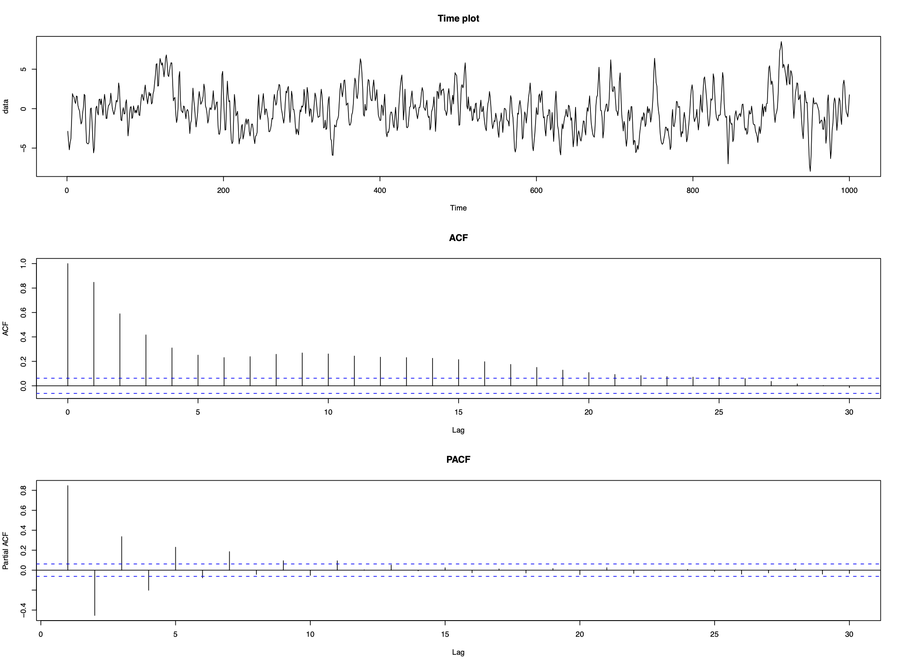

```{r setup, include=FALSE} 
knitr::opts_chunk$set(warning = FALSE, message = FALSE) 
```

# Chapter 5: More general time series processes

For most data sets the AR and MA models will be adequate to represent short-term correlation, with autoregressive correlation occurring more often than moving average. However, occasionally you may meet data that are not well represented by either of these time series processes, an example of which is shown below. 

Example: 

Consider the following data which appear to be stationary but contain short-term correlation.



The ACF and PACF suggest that neither an AR nor an MA process is appropriate, but as these are the only models we know, we fit them to the data to see how well they remove the short-term correlation. We chose the order (p and q) as the lowest values that removed the majority of the correlation, which resulted in an AR(6) model or an MA(5) model:


Neither fits the data perfectly as the residual series isn't white noise. Both also used high order processess (p=6 and q=5) which include a relatively large number of parameters. This emphasizes two points:

1. Even if the correlation structure does not look like an AR(p) or an MA(q) process, fitting these models with large enough p and q will remove the majority of the correlation. Therefore it is better to model correlation with the wrong time series process than not to model it at all.

2. However, AR(p) and MA(q) processes are not always appropriate models for short-term correlation

## ARMA model

An Autoregressive Moving Average process of order (p,q) denoted ARMA(p,q) is given by

$$\begin{eqnarray}
X_{t}&=&\alpha_{1}X_{t-1}+\ldots+\alpha_{p}X_{t-p} + Z_{t} + \lambda_{1}Z_{t-1}+\ldots+\lambda_{q}Z_{t-q}\nonumber\\
&=&\sum_{j=1}^{p}\alpha_{j}X_{t-j}+\sum_{j=1}^{q}\lambda_{j}Z_{t-j} + Z_{t}\nonumber
\end{eqnarray}
$$

Using Backshift operator the model can be rewritten as

$$\phi(B)X_{t} = \theta(B)Z_{t}$$

Example:

The data in the first example can be modelled by an ARMA(1,1) process

$$X_{t}=\alpha X_{t-1}+\lambda Z_{t-1}+Z_{t}
$$


### Mean of ARMA(p,q) process

$$E[X_t] = 0$$

### Variance and autocorrelation function

Variance:

$$\begin{eqnarray}
\mathrm{Var}[X_{t}]&=&\alpha \gamma_{1}+\lambda (\alpha\sigma^{2}_{z} + \lambda\sigma^{2}_{z})+\sigma^{2}_{z}\nonumber\\
&=&\alpha \gamma_{1}+\sigma^{2}_{z}(\lambda^{2}+\lambda\alpha+1).\nonumber
\end{eqnarray}
$$

Autocorrelation function:

$$\rho_{\tau}=\alpha \rho_{\tau-1}$$

### Stationarity and Invertibility

We know that MA(q) process is always stationary and AR(p) process is always invertible. Therefore an ARMA(p,q) process

1. is stationary if the AR(p) part is stationary, i.e., if the roots of the AR(p) characteristic polynomial have modulus larger than 1; and

2. is invertible if the MA(q) part is invertible, i.e., if the roots of the MA(q) characteristic polynomial have modulus larger than 1

Example:

Consider the ARMA(1,1) process 

$$X_{t}=2X_{t-1}-0.4Z_{t-1}+Z_{t}$$

which can be re-written as 

$$X_{t}(1-2B)=Z_{t}(1-0.4B)$$

AR part has root $B=0.5$, therefore the process is not stationary. The MA part has root $B=2.5$, therefore the process is invertible. 

### ARMA model identification

AR and MA processes are straightforward to identify from ACF and PACF:

1. If the ACF is significantly different from zero for only the first q lags (for small q), then an MA(q) model is appropriate.

2. If the PACF is significantly different from zero for only the first lags (for small p), then an AR(p) model is appropriate.

Take another look at the data in the first example:


Neither the ACF or PACF give any clues as to the appropriate type of time series process. All they tell us is that it is not an AR(p) process or an MA(q) process

Notes:

1. Model identification for ARMA(p,q) process when p,q > 0 is difficult

2. First determine if the ACF and PACF resemble either an MA(q) or an AR(p) process

3. If not then adopt a trial and error approach, starting with the simplest model (i.e., an ARMA(1,1)) and increasing the complexity until the correlation has been removed. 

### ARMA parameter estimation

Not in this course.

### ARMA simulation example

Chapter 2 discussed methods of removing trends and seasonal variation from time series data, while chapters 3 to 5 have described how to model short-term correlation in a stationary time series. But is modelling correlation important or can we simply ignore it?

We look at the consequences of ignoring correlation using simulation. Consider the simple linear trend model

$$X_{t}=\beta_{0}+\beta_{1}t+e_{t}$$

where $e_t$ could be independent errors or correlated. The aim is to estimate the slope coefficient $\beta_1$ and produce a 95% confidence interval. Two natural questions you could ask:

1. Effect of correlation structure of $e_t$ on the estimate and CI of $\beta_1$

2. If $e_t$ is correlated, can we allow for this correlation when we estimate $\beta_1$?

#### Generate data: 

Time series of length 1000 from 2 models:

A: $X_t=30+0.1t+Z_t$
B: $X_t=30+0.1t+Y_t$

where the regression parameter $\beta=0.1$

  - $Z_t$ is a purely random process (white noise), meaning that model A is a linear trend with independent errors
  
  - $Y_t$ is an AR(1) process with lag one autocorrelation coefficient equal to 0.9, meaning that model is a linear trend with correlated errors
  
We simulate 1000 sets of data from models A and B:

```{r}
n <- 1000
sd <- 10
corr.ar1 <- arima.sim(model = list(ar = c(0.9)), n = n, sd = sd)
corr.indep <- arima.sim(model = list(),  n = n, sd = sd)[1:n]
time <- 1:n
data.ar1 <- corr.ar1 + 30 + 0.1*time
data.indep <- corr.indep + 30 + 0.1*time
```

#### Measure model quality

From 1000 simulated data points we get 1000 estimates of $\beta, \hat \beta_1,...,\hat\beta_{1000}$. Using 3 standard metrics to determine how good they are:

1. Bias - On average how different is $\beta$ from the estimates, which is calculated as

$$\mbox{Bias}(\beta)=\mathbb{E}[\hat{\beta}]-\beta~=~\frac{1}{1000}\sum_{j=1}^{1000}\hat{\beta}_{j} - \beta.
$$

2. Root mean square error (RMSE) - How much variation is there between 1000 estimates:

$$\mbox{RMSE}(\beta)=\sqrt{\mathbb{E}[(\hat{\beta}-\beta)^{2}]}~=~\sqrt{\frac{1}{1000}\sum_{j=1}^{1000}(\hat{\beta}_{j} - \beta)^{2}}.
$$

3. Coverage probability - Each data set produces an estimate and 95% CI for $\beta$. What percentage of the 95% CI contain the true value $\beta$

#### Conduct the simulation study 

We answer the questions listed above:


1. Effect of correlation structure of $e_t$ on the estimate and CI of $\beta_1$?

Naively assume that both data sets are independent, and estimate $\beta_1$ and its 95% confidence interval using the lm() function. Save the estimates and 95% CI from each data set and calculate the bias, RMSE, and coverage probability.

2. If $e_t$ is correlated, can we allow for this correlation when we estimate $\beta_1$?

Simultaneously estimate the linear trend and model the correlation using the arima() function. The R code to do this is as follows:

```{r}
model.ar1 <- lm(data.ar1 ~ time)
arima(data.ar1, order = c(1, 0, 0), xreg = time)
```

The following strategy is appropriate for modelling trend and correlation in time series data using regression methods:

1. First remove any trend and seasonal variation assuming the observation are independent using the lm() function, since at this stage we do not know if there is any correlation

2. Determine whether the residuals have any short-term correlation, if so what type of stationary time series model is appropriate

3. Finally, simultaneously estimate the correlation and trend using the arima() function


## ARIMA model

An alternative approach to model trend, seasonal variation, and correlation simultaneously (instead of modelling trend and seasonality first, then model the residuals with a short-term correlation model of AR(p) or MA(q)) is ARIMA(p,d,q). This model is not appropriate if the goal is to capture the shape of the trend or seasonal variation. 

ARIMA(p,d,q) combines ARMA(p,q) and differencing by order differences of d (difference d times)

### Definition

$\{X_t\}$ is an Autoregressive Integrated Moving Average model of order (p,d,q), denoted ARIMA(p,d,q) if the $d^{th}$ order differenced process
$$Y_t = \nabla^d X_t =(1-B)^d X_t
$$
is an ARMA(p,q) process. An ARIMA(p,d,q) process can be written most easily in terms of characteristic polynomials. If we write the ARMA(p,q) process for $Y_t$ as $\phi(B)Y_t=\theta(B)Z_t$ then as $Y_{t}=(1-B)^d X_t$, an ARIMA(p,d,q) can be written as

$$\phi(B) (1-B)^d X_t = \theta(B) Z_t$$
Notes:

1. The characteristic polynomial for the AR part of the ARIMA model is equal to $\phi^*(B) = \phi(B) (1-B)^d$ which has d roots equal 1. Thus an ARIMA process cannot be stationary unless d = 0

2. ARIMA(p,0,q) = ARMA(p,q)

Examples:

ARIMA(0,1,0) is a random walk process. Note that AR(1) is also a random walk process if $\alpha=1$:

$$\begin{eqnarray}
(1-B)X_{t}&=&Z_{t}\nonumber\\
X_{t}-X_{t-1}&=&Z_{t}\nonumber\\
X_{t}&=&X_{t-1}+Z_{t}\nonumber
\end{eqnarray}$$

ARIMA(0,0,0) is a purely random process:

$$\begin{eqnarray}
(1-B)^{0}X_{t}&=&Z_{t}\nonumber\\
X_{t}&=&Z_{t}\nonumber
\end{eqnarray}$$

ARIMA(1,1,1) process has characteristic polynomials $\phi(B)=1-\alpha B$ and $\theta(B)=1+\lambda B$, meaning the full model is given by

$$\begin{eqnarray}
(1-\alpha B)(1-B)X_{t}&=&(1+\lambda B)Z_{t}\nonumber\\
(1-B-\alpha B + \alpha B^{2})X_{t}&=&\lambda Z_{t-1}+Z_{t}\nonumber\\
X_{t}&=&(1+\alpha)X_{t-1}-\alpha X_{t-2} +\lambda Z_{t-1}+Z_{t}.\nonumber
\end{eqnarray}$$

So ARIMA(1,1,1) model is essentially a non-stationary ARMA(2,1) model

### ARIMA model identification

1. Choose $d$ - Plot the time series and its correlogram and determine whether data contain a trend. If there is no trend then $d=0$, otherwise increase $d$ by 1 and repeat this step until the process is stationary

2. Choose $p$ and $q$ - Plot the ACF and PACF of the $d^{th}$ order differences, and determine the apporiate ARMA(p,q) model

3. Estimate the parameters - Use the ARIMA() function in R to estimate the parameters of the ARIMA process. 

4. Residual diagnosis - Plot the timeplot, ACF and PACF of the residuals and determine whether they contain any remaining trend, seasonal variation or short-term correlation. A test for correlation such as the one based on the Ljung-Box statistic could also be used. If the residuals resemble a purely random process (white noise) then stop, otherwise return to stage one and change either p, d, or q.

### Example 1

Below are the realisations of an ARIMA(1,1,0) (left) and ARIMA(0,1,1) (right) processes. Data are non-stationary and have a trend, there fore the ACF is not informative regarding the presence of absence of short-term correlation. 

```{r}
# Simulate ARIMA(1,1,0) and ARIMA(0,1,1) data
n <- 1000
sd <- 1
data1 <- arima.sim(model = list(ar = c(0.7), order = c(1, 1, 0)), n = n, sd = sd)
data2 <- arima.sim(model = list(ma = c(0.7), order = c(0, 1, 1)), n = n, sd = sd)

par(mfrow = c(3, 2))
plot(data1, main = "ARIMA(1,1,0) data")
plot(data2, main = "ARIMA(0,1,1) data")
acf(data1, main = "ARIMA(1,1,0) ACF")
acf(data2, main = "ARIMA(0,1,1) ACF")
pacf(data1, main = "ARIMA(1,1,0) PACF")
pacf(data2, main = "ARIMA(0,1,1) PACF")
```

### Example 2

Daily respiratory admissions data for Glasgow between 2000 and 2007. Here we model the trend and correlation using ARIMA(p,d,q) model. 


First order difference plot appear to be stationary with mean of zero, meaning that d = 1 is adequate. The ACF and PACF of the first order differences show that the differencing process has induced negative correlation into the data.


An MA(1) process appears to be an appropriate model so we fit an ARIMA(0,1,1) to the original data. This provides the following residuals shown below


These residuals appear to resemble a purely random process with no correlation, so the ARIMA(0,1,1) model appears to be appropriate.

# Chapter 5 Lab

## Oil Return

An example using ARMA(1,1) process:

```{r echo=TRUE}
library(astsa)

plot(oil)

# Calculate approximate oil returns
oil_returns <- diff(log(oil))

# Plot oil_returns. Notice the outliers.
plot(oil_returns)

# Plot the P/ACF pair for oil_returns
acf2(oil_returns)

# Assuming both P/ACF are tailing, fit a model
sarima(oil_returns, p = 1, d = 0, q = 1)
```
Oil price is hard to model since there is a 2008 peak period for oil price followed by a sharp drop due to the financial crisis. Taking the first order difference yields the daily return of oil, but the data is not quite stationary. The ACF and PACF suggests an ARMA(1,1) model, which I fitted to the differenced series. The residuals does not look like white noise and failed the Q-Q plot and Ljung-Box statistic. 


## Air Passengers

```{r}
# Load data
library(astsa)
plot(AirPassengers)
```

From the plot of Air Passengers, there are: trend, seasonal variation, heteroscedasticity (variance increases over time). 

## Birth Rate

```{r}

plot(birth)
# Plot P/ACF to lag 60 of differenced data
d_birth <- diff(birth)
acf2(d_birth, max.lag = 60)

# Plot P/ACF to lag 60 of seasonal differenced data
dd_birth <- diff(d_birth, lag = 12)
acf2(dd_birth, max.lag = 60)

# Fit SARIMA(0,1,1)x(0,1,1)_12. What happens?
sarima(birth, p = 0, d = 1, q = 1, P = 0, D = 1, Q = 1, S = 12)

# Fit another model, this time with an AR
sarima(birth, p = 1, d = 1, q = 1, P = 0, D = 1, Q = 1, S = 12)

```