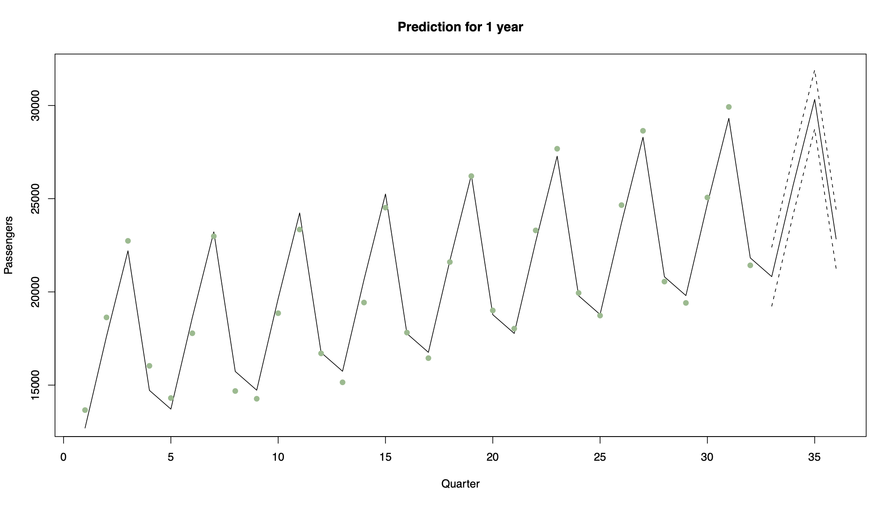

```{r setup, include=FALSE} 
knitr::opts_chunk$set(warning = FALSE, message = FALSE) 
```

# Chapter 6: Forecasting

Predicting the value of a time series at future points in time. The majority of forecasting methods are based on a statistical model, so if the model is not appropriate, then the forecasts will be useless. Even if an appropriate model is fitted, it does not mean the forecasts will be reasonable. However, despite these reservations forecasting is vitally important, and is often the sole goal of a time series analysis.

## General problem

A time series has been observed at $n$ time points and predictions are required for the series at time $n+1, n+2$, etc. 

We denote the $k$ steps ahead forecast of $x_{n+k}$ given data $(x_1,...,x_n)$ by $x_n(k)$, so that $x_n(1)$ is the prediction of $x_{n+1}$ based on data up to and including time $n$

Forecast error is given by

$$e_{n}(k)=x_{n+k}-x_{n}(k)$$

and is the amount by which the forecast differs from the true observation (once it has become available). The amount of uncertainty in a forecast is measured by the size of its error variance, $\mathrm{Var}[e_{n}(k)$, with larger values meaning the forecast is less reliable.

To evaluate the performance of a forecasting method on a given data set, we calculate 1 step ahead forecasts $x_{1}(1),\ldots, x_{n-1}(1)$ and measure the discrepancy to the observed values $x_{2},\ldots,x_{n}$ using the root mean square prediction error

$$\mbox{RMSPE}=\sqrt{\frac{1}{n-1}\sum_{k=1}^{n-1}e_{k}(1)^{2}}=\sqrt{\frac{1}{n-1}\sum_{k=1}^{n-1}(x_{k+1}-x_{k}(1))^{2}}$$

We will compare three methods of forecasting: regression, exponential smoothing and ARIMA models.

## Regression

One approach is to ignore the temporal correlation in the observed data, and predict the next value of the time series based on linear regression methods. This method will only produce good forecasts if the time series being predicted has a strong trend and seasonal component compared to the amount of random variation and short-term correlation

Additive time series model $X_{t}=m_{t}+s_{t}+e_{t}$ the trend and seasonal variation are represented by $m_{t}+s_{t}=\textbf{z}_{t}^\top\boldsymbol{\beta};$.


The 1 step ahead prediction is then given by
$$x_{n}(1)=\mathbf{z}_{n+1}^\top\hat{\boldsymbol{\beta}}$$

where $\beta$ is the cector of regression parameter estimates and $\mathbf{z}_{n+1}^\top$ are the covariate values at time $n+1$. Approximate 95% prediction intervals can be calculated from linear model theory as

$$\mathbf{z}_{n+1}^\top\hat{\boldsymbol{\beta}}\pm 1.96\sqrt{\hat{\sigma}^{2}
(1+\mathbf{z}_{n+1}^\top(Z^\top Z)^{-1}\mathbf{z}_{n+1})}$$

where $\hat{\sigma}^{2}$ is the estimated residual variance from the linear model, and $Z$ is the matrix of regression variables for all $n$ time points.

### Example 1

Consider the daily respiratory admissions data presented in Chapter 2. One of the trend models for these data was

$$X_{t}=\beta_{0}+\beta_{1}t+\beta_{2}\sin(2\pi t/365)+\beta_{3}\cos(2\pi t /365) + e_{t}$$

which modelled the regular seasonal pattern with a period of a year and a linear trend. Figure 6.1 shows the last year of these data, together with predictions for the first 100 days in 2008 using the model above. Note in this case how wide the prediction intervals are, because the seasonal pattern is overwhelmed by random variation. Thus the predictions are not likely to be very accurate.


### Example 2

Consider air traffic data, which can be modelled using a quarterly seasonal indicator variable and a linear trend.



Note that in this case the data are dominated by trend and seasonal variation, and have relatively little unexplained variation. Therefore the prediction intervals are narrow, suggesting the predictions will be fairly accurate.

### Example 3

Consider the following linear trend model

$$X_t=10+2t+\epsilon_t\hspace{1cm}t=1,\ldots,10$$

where $\hat{\boldsymbol{\beta}}=(10,2)$ and $\hat\sigma^2=1$. The design matrix is given by

$$Z=\left(\begin{array}{cc}
1& 1\\
1&2\\
\vdots&\vdots\\
1&10\\
\end{array}\right)$$

Calculate a prediction and 95% vinterval for time 11 where $\mathbf{z}_{11}^\top=(1,11)$

The prediction is given by

$$x_{10}(1)~=~\mathbf{z}_{11}^\top\hat{\boldsymbol{\beta}}~=~ 1 \times 10 + 11 \times 2~=~32$$

To calculate the standard error we have that 
$$Z^\top Z=\left(\begin{array}{cc}10 &55\\55 & 385\end{array}\right)
\hspace{2cm}\mbox{and}\hspace{2cm}
(Z^\top Z)^{-1}=\left(\begin{array}{cc}0.46667 &-0.06667\\-0.06667 & 0.01212\end{array}\right)$$

Therefore we have that

$$\mathrm{Var}[x_{10}(1)]~=~\hat{\sigma}^{2}(1+\mathbf{z}_{11}^\top (Z^\top Z)^{-1}\mathbf{z}_{11})=1.4665$$

and the 95% CI

$$\begin{eqnarray}
\mathbf{z}_{n+1}^\top\hat{\boldsymbol{\beta}}&\pm& 1.96\sqrt{\hat{\sigma}^{2}
(1+\mathbf{z}_{n+1}^\top (Z^\top Z)^{-1}\mathbf{z}_{n+1})}\nonumber\\
32 &\pm& 1.96\times \sqrt{1.4665}\nonumber\\
32 &\pm& 2.374\nonumber\\
(29.63&,&34.37)\nonumber
\end{eqnarray}
$$

## Exponential smoothing

Exponential smoothing is a simple procedure that does not assume a parametric model for the data, and is similar to moving average smoothing discussed in Chapter 2. It makes one step ahead forecasts of the form

$$\hat{x}_{n}(1)=c_{0}x_{n}+c_{1}x_{n-1}+c_{2}x_{n-2}+\ldots+c_{n-1}x_{1}$$

where the coefficient $(c_{0},\ldots,c_{n-1})$ are called weights and must sum to one so that the prediction is of the correct size. In addition, the weights decrease as the observations move further away from the time point being predicted, i.e. $c_{0}\geq c_{1} \geq\ldots\geq c_{n-1}$

### Definition

Given data $(x_{1},\ldots,x_{n})$ the one step ahead forecast using exponential smoothing is given by

$$\hat{x}_{n}(1)=\alpha x_{n}+\alpha(1-\alpha)x_{n-1}+\alpha(1-\alpha)^{2}x_{n-2}+\ldots+\alpha(1-\alpha)^{n-1}x_{1}$$

where $\alpha\in[0,1]$ is a smoothing parameter

Notes:

1. If $\alpha$ is close to 1, predictions are based on only the last few observations

2. If $\alpha$ is close to 0, predictions are based on a large number of previous observations

The one step ahead forecast can be written recursively as follows

$$\begin{eqnarray}
\hat{x}_{n}(1)&=&\alpha x_{n}+\alpha(1-\alpha)x_{n-1}+\alpha(1-\alpha)^{2}x_{n-2}+\ldots+\alpha(1-\alpha)^{n-1}x_{1}\nonumber\\
&=&\alpha x_{n}+(1-\alpha)[\alpha x_{n-1}+\alpha(1-\alpha)x_{n-2}+\ldots+\alpha(1-\alpha)^{n-2}x_{1}]\nonumber\\
&=&\alpha x_{n}+(1-\alpha)\hat{x}_{n-1}(1)\nonumber
\end{eqnarray}$$

making it straightforward computationally to update the forecasts in light of new data. To start the process, we set $\hat{x}_{1}(1)=x_{2}$

### Choosing $\alpha$

Choose $\alpha$ that minimizes the root mean square prediction error (RMSPE)

In other words, for each candidate value of $\alpha$:

1. Calculate $\hat{x}_{1}(1),\ldots,\hat{x}_{n-1}(1)$ using the recursive formula described above

2. Calculate the RMSPE

$$\mbox{RMSPE}=\sqrt{\frac{1}{n-1}\sum_{k=1}^{n-1}(x_{k+1}-x_{k}(1))^{2}}$$

and choose the value of $\alpha$ that minimizes this quantity

### Measure uncertainty

For exponential smoothing it has been shown that an approximate 95% prediction interval for $x_{n}(1)$ is given by

$$\hat{x}_{n}(1)\pm1.96\sqrt{\mathrm{Var}[e_{n}(1)]}
$$

where $\mathrm{Var}[e_{n}(1)]$ can be approximated as the variance of the forecast errors $e_{1}(1),e_{2}(1),\ldots,e_{n-1}(1)$, i.e. 

$$\mathrm{Var}[e_{n}(1)]=\frac{1}{n-2}\sum_{i=1}^{n-1}(e_{i}(1)-\bar{e})^{2}
$$

with $\bar{e}=\sum_{i=1}^{n-1}e_{i}(1)/(n-1)$

#### Example 

Given the time series $\mathbf{x}=(1,2,4,4,6,5,7,9,9,10)$, calculate $x_{10}(1)$ using only the last 5 observations for $\alpha=0.1, 0.5, 0.9$

$$\alpha=0.5\hspace{0.5cm}x_{10}(1)=0.5\times 10 + 0.5(1-0.5)\times 9 + 0.5(1-0.5)^{2}\times 9
+ 0.5(1-0.5)^{3}\times 7\\ + 0.5(1-0.5)^{4}\times 5~=~8.89
$$

Note that as we are only using the last 5 observations to compute the forecasts, the prediction when $\alpha=0.1$ is artificially low

## Forecasting from AR(p) models

Assume the time series predicted is stationary with zero mean, as any trend or seasonal variation can be predicted using the regression methods described above. 

### AR(1) forecasting

AR(1) process $X_{t}=\alpha X_{t-1}+Z_{t}$. Then the one step ahead forecast is given by

$$\begin{eqnarray}
\hat{x}_{n}(1)&=&\mathbb{E}[X_{n+1}|X_{n},X_{n-1},\ldots,X_{1}]\nonumber\\
&=&\mathbb{E}[\alpha X_{n}+Z_{n+1}|X_{n},X_{n-1},\ldots,X_{1}]\nonumber\\
&=&\alpha \mathbb{E}[X_{n}|X_{n},X_{n-1},\ldots,X_{1}]+\mathbb{E}[Z_{n+1}|X_{n},X_{n-1},\ldots,X_{1}]\nonumber\\
&=&\alpha x_{n}\nonumber
\end{eqnarray}$$

where $x_n$ is the observed value of the series at time $n$ and $\mathbb{E}[Z_{n+1}|X_{n},X_{n-1},\ldots,X_{1}]=0$. The two steps ahead forecast is given by

$$\begin{eqnarray}
\hat{x}_{n}(2)&=&\mathbb{E}[X_{n+2}|X_{n},X_{n-1},\ldots,X_{1}]\nonumber\\
&=&\mathbb{E}[\alpha X_{n+1}+Z_{n+2}|X_{n},X_{n-1},\ldots,X_{1}]\nonumber\\
&=&\alpha \mathbb{E}[X_{n+1}|X_{n},X_{n-1},\ldots,X_{1}]+\mathbb{E}[Z_{n+2}|X_{n},X_{n-1},\ldots,X_{1}]\nonumber\\
&=&\alpha^{2} x_{n}.\nonumber
\end{eqnarray}$$

Iterating the above procedure gives the $k$ steps ahead forecast as 

$$\hat{x}_{n}(k)=\alpha^{k}x_{n}$$

The forecast error variance at one step ahead is given by

$$\begin{eqnarray}
\mathrm{Var}[e_{n}(1)]&=&\mathrm{Var}[X_{n+1}-\hat{x}_{n}(1)]\nonumber\\
&=&\mathrm{Var}[\alpha X_{n}+Z_{n+1} -\alpha X_{n}]\nonumber\\
&=&\mathrm{Var}[Z_{n+1}]\nonumber\\
&=&\sigma^{2}_{z}\nonumber
\end{eqnarray}
$$
and at two steps ahead it is

$$\begin{eqnarray}
\mathrm{Var}[e_{n}(2)]&=&\mathrm{Var}[X_{n+2}-\hat{x}_{n}(2)]\nonumber\\
&=&\mathrm{Var}[\alpha X_{n+1}+Z_{n+2} -\alpha \hat{x}_{n}(1)]\nonumber\\
&=&\mathrm{Var}[Z_{n+2}]+\alpha^{2}\mathrm{Var}[X_{n+1}-\hat{x}_{n}(1)]\nonumber\\
&=&\sigma^{2}_{z}(1+\alpha^{2}).\nonumber
\end{eqnarray}
$$

This process can also be iterated to give 

$$\mathrm{Var}[e_{n}(k)]=\sigma^{2}_{z}(1+\alpha^{2}+\ldots+\alpha^{2(k-1)})=\sigma^{2}_{z}\frac{1-\alpha^{2k}}{1-\alpha^{2}}
$$

because it is the sum of a geometric progression with finitely many terms. Approximate 95% prediction intervals are now straightforward to calculate as

$$\hat{x}_{n}(k)\pm 1.96\sqrt{\mathrm{Var}[e_{n}(k)]}.
$$

Note: the variance gets a lot higher the further we predict into the future (more uncertainty)

### AR(p) forecasting

For an AR(p) process $X_{t}=\alpha_{1}X_{t-1}+\ldots+\alpha_{p}X_{t-p}+Z_{t}$, the one step ahead forecast is given by

$$\begin{eqnarray}
\hat{x}_{n}(1)&=&\mathbb{E}[X_{n+1}|X_{n},X_{n-1},\ldots,X_{1}]\nonumber\\
&=&\mathbb{E}[\alpha_{1}X_{n}+\ldots+\alpha_{p}X_{n-p+1}+Z_{n+1}|X_{n},X_{n-1},\ldots,X_{1}]\nonumber\\
&=&\alpha_{1}x_{n}+\ldots+\alpha_{p}x_{n-p+1}.\nonumber
\end{eqnarray}
$$

Then for any $k$, the $k$ steps ahead forecast is given by

$$\begin{eqnarray}
\hat{x}_{n}(k)&=&\mathbb{E}[X_{n+k}|X_{n},X_{n-1},\ldots,X_{1}]\nonumber\\
&=&\mathbb{E}[\alpha_{1}X_{n+k-1}+\ldots+\alpha_{p}X_{n+k-p}+Z_{n+k}|X_{n},X_{n-1},\ldots,X_{1}]\nonumber\\
&=&\alpha_{1}\mathbb{E}[X_{n+k-1}|X_{n},X_{n-1},\ldots,X_{1}]+\ldots+\alpha_{p}\mathbb{E}[X_{n+k-p}|X_{n},X_{n-1},\ldots,X_{1}].\nonumber
\end{eqnarray}
$$

Two cases occur for these conditional expectations

1. If $X_{n+k-j}$ has been observed, then $\mathbb{E}[X_{n+k-j}|X_{n},X_{n-1},\ldots,X_{1}]$ is equal to its observed value, $x_{n+k-j}$

2. If $X_{n+k-j}$ is a future value, then $\mathbb{E}[X_{n+k-j}|X_{n},X_{n-1},\ldots,X_{1}]$ has already been forecast as one of $\hat{x}_{n}(1),\ldots,\hat{x}_{n}(k-1)$

The error variance for the $k$ steps ahead forecast has the general form

$$\mathrm{Var}[e_{n}(k)]=\sigma^{2}_{z}\sum_{i=0}^{k-1}\theta_{i}^{2}$$

where $\theta_{0}=1$, and the remaining $\theta_i$ are algebraically nasty to determine. Prediction invervals can be calculated using the same formula as for the AR(1) model.

### Example 1: Simulated data

Simulated AR(1) process of length 100, with 20 future predictions together with prediction intervals

```{r}
n <- 100
x <- arima.sim(model = list(ar = 0.8), n = n)
model <- arima(x, order = c(1, 0, 0), include.mean = FALSE)
predict.ar1 <- predict(model, n.ahead = 20, se.fit = TRUE)
predict.lci <- predict.ar1$pred - 1.96*predict.ar1$se
predict.uci <- predict.ar1$pred + 1.96*predict.ar1$se
```


Note how the forecasts fall to zero as $k$ increases from 1 to 20. 

### Example 2

AR(1) process $X_{t}=0.9X_{t-1}+Z_{t}$, where $\hat{\sigma}^{2}_{z}=1$ and $x_{n}=20$. Calculate the one and two steps ahead forecasts and the associated error variances

The forecasts are given by

$$\hat{x}_{n}(1) = \alpha x_{n} = 0.9\times 20 = 18
$$

and the error variances are 

$$\mathrm{Var}[e_{n}(1)] = \hat{\sigma}^{2}_{z} = 1\hspace{1cm}\mbox{and}\hspace{1cm}
\mathrm{Var}[e_{n}(2)] = \hat{\sigma}^{2}_{z}(1+\alpha^{2}) = 1.81
$$

### Example 3

AR(1) process $X_{t}=0.1X_{t-1}+Z_{t}$ where $\hat\sigma^2=1$ and $x_n=20$ 

Calculate the one and two steps ahead forecasts and the associated error variances

The forecasts are given by

$$\hat{x}_{n}(1) = \alpha x_{n} = 0.1\times 20 = 2$$

and the error variances are 

$$\mathrm{Var}[e_{n}(1)] = \hat{\sigma}^{2}_{z} = 1\hspace{1cm}\mbox{and}\hspace{1cm}
\mathrm{Var}[e_{n}(2)] = \hat{\sigma}^{2}_{z}(1+\alpha^{2}) = 1.01
$$

Notes:
1. As the lag 1 coefficient gets smaller the forecasts get closer to zero

2. As the lag 1 coefficient gets smaller the two steps ahead forecast error gets smaller

## Forecasting from MA(q) models

Forecasting with an MA(q) model is similar to forecasting with an AR(p) model, as both is based on the conditional expectation

$$\hat{x}_{n}(k)=\mathbb{E}[X_{n+k}|X_{n},X_{n-1},\ldots,X_{1}].
$$

### MA(1) forecast

For the MA(1) model $X_t=\lambda Z_{t-1}+Z_t$, the one step ahead forecast is given by 

$$\begin{eqnarray}
\hat{x}_{n}(1)&=&\mathbb{E}[X_{n+1}|X_{n},X_{n-1},\ldots,X_{1}]\nonumber\\
&=&\mathbb{E}[\lambda Z_{n}+Z_{n+1}|X_{n},X_{n-1},\ldots,X_{1}]\nonumber\\
&=&\lambda\mathbb{E}[Z_{n}|X_{n},X_{n-1},\ldots,X_{1}] + \mathbb{E}[Z_{n+1}|X_{n},X_{n-1},\ldots,X_{1}]\nonumber\\
&=&\lambda z_{n}.\nonumber
\end{eqnarray}
$$

The last line is true because 

1. $X_{n},X_{n-1},\ldots,X_{1}$ do not depend on $Z_{n+1}$, and hence

$$\mathbb{E}[Z_{n+1}|X_{n},X_{n-1},\ldots,X_{1}]~=~\mathbb{E}[Z_{n+1}]~=~0.
$$

2. In contrast, $X_n$ depends on $Z_n$ so 

$$\mathbb{E}[Z_{n}|X_{n},X_{n-1},\ldots,X_{1}]~\neq~\mathbb{E}[Z_{n}]~=~0.
$$

$Z_n$ cannot be observed directly but it can be estimated as follows. Re-write the MA(1) process as, $Z_t=X_t-\lambda Z_{t-1}$ and assuming that $Z_0=0$, $Z_t$ can be estimated iteratively from $t=1,\ldots,n$ by replacing $X_t$ by its observed value $x_t$

For k>1 the k steps ahead forecast is given by

$$\begin{eqnarray}
\hat{x}_{n}(k)&=&\mathbb{E}[X_{n+k}|X_{n},X_{n-1},\ldots,X_{1}]\nonumber\\
&=&\mathbb{E}[\lambda Z_{n+k-1}+Z_{n+k}|X_{n},X_{n-1},\ldots,X_{1}]\nonumber\\
&=&0.\nonumber
\end{eqnarray}
$$

The forecast error variance at one step ahead is given by 

$$\begin{eqnarray}
\mathrm{Var}[e_{n}(1)]&=&\mathrm{Var}[X_{n+1}-\hat{x}_{n}(1)]\nonumber\\
&=&\mathrm{Var}[\lambda Z_{n}+Z_{n+1} -\lambda Z_{n}]\nonumber\\
&=&\mathrm{Var}[Z_{n+1}]\nonumber\\
&=&\sigma^{2}_{z}\nonumber
\end{eqnarray}
$$

while for k>1 it is given by 

$$\begin{eqnarray}
\mathrm{Var}[e_{n}(k)]&=&\mathrm{Var}[X_{n+k}-\hat{x}_{n}(k)]\nonumber\\
&=&\mathrm{Var}[X_{n+k}]\nonumber\\
&=&\sigma^{2}_{z}(1+\lambda^2).\nonumber
\end{eqnarray}
$$

Then 95% prediction intervals can be calculated as before using the formula 

$$\hat{x}_{n}(k)\pm 1.96\sqrt{\mathrm{Var}[e_{n}(k)]}.
$$

### MA(q) forecasts

Works the same way as MA(1) model, the one step ahead forecast is given by

$$\begin{eqnarray}
\hat{x}_{n}(1)&=&\mathbb{E}[X_{n+1}|X_{n},X_{n-1},\ldots,X_{1}]\nonumber\\
&=&\mathbb{E}[\lambda_{1}Z_{n}+\ldots+\lambda_{q}Z_{n-q+1}+Z_{n+1}|X_{n},X_{n-1},\ldots,X_{1}]\nonumber\\
&=&\lambda_{1}z_{n}+\ldots+\lambda_{q}z_{n-q+1}\nonumber
\end{eqnarray}
$$
where as before the current and past values of $Z_t$ are calculated recursively from the MA(q) equation

$$Z_{t}=X_{t}-\lambda_{1}Z_{t-1}-\ldots-\lambda_{q}Z_{t-q}$$

with the initial conditions $Z_{0}=Z_{-1}=\ldots=Z_{-q+1}=0$. The general k steps ahead forecast is calculated in an identical way, where current past values of $Z_t$ are estimate from the data, while future values are set to zero. Therefore the forecast is given by

$$\begin{equation*}
  \hat{x}_n(k) =
  \begin{cases}
    \lambda_k z_n + \cdots + \lambda_q z_{n+k-q} & \text{if $k\leq q$} \\
    0 & \text{if $k > q$}.
  \end{cases}
\end{equation*}
$$

It is straightforward to show that the k steps ahead error variance is given by

$$\begin{equation*}
  e_n(k) =
  \begin{cases}
     \sigma^{2}_{z}[1+\sum_{i=1}^{k-1}\lambda_{i}^{2}]& \text{if $k\leq q$} \\
    \sigma^{2}_{z}[1+\sum_{i=1}^{q}\lambda_{i}^{2}] & \text{if $k > q$}.
  \end{cases}
\end{equation*}
$$

#### Example 1

MA(3) process of length 100 with 20 future predictions together with prediction intervals. Note how the forecasts fall to zero for k > 3, which was shown algebraically earlier. 


#### Example 2

Consider modelling the short time series $\mathbf{x}=(3,8,2,5,6)$ with an MA(1) time series process $X_{t}=0.7Z_{t-1}+Z_{t}$ where $\hat{\sigma}^{2}_{z}=1$. Calculate the one and two steps ahead forecasts $x_{5}(1)$ and $x_{5}(2)$ as well as their associated error variances

To calculate the forecasts we need to recursively estimate $Z_{1},\ldots,Z_{5}$ assuming that $z_{0}=0$. This gives 

$$z_{1}=3,\hspace{0.5cm}z_{2}=5.9,\hspace{0.5cm}z_{3}=-2.13, \hspace{0.5cm}z_{4}=6.491, 
\hspace{0.5cm}z_{5}=1.4563
$$
$$\hat{x}_{5}(1)~=~\lambda z_{5}~=~0.7\times 1.4563~=~1.01941
$$
$$\hat{x}_{n}(2)~=~0
$$

And the error variances are 

$$\mathrm{Var}[e_{n}(1)]~=~\hat{\sigma}^{2}_{z}~=~1\hspace{1cm}\mbox{and}\hspace{1cm}
\mathrm{Var}[e_{n}(2)]~=~\hat{\sigma}^{2}_{z}(1+\lambda^2)~=~1.49.
$$

## Forecasting time series with trend, seasonality and correlation

There are a number of ways to forecast a time series that contains trend and seasonal variation in addition to short-term correlation. The method we consider in this course is a natural combination of regression and ARMA(p,q) models. For the time series model $X_t=m_t+s_t+e_t$ we represent the trend and seasonal variation by $m_t+s_t=\textbf{z}_{t}^\top \boldsymbol{\beta}$ while the residuals are given by $e_{t}^{*}=X_{t}-\textbf{z}_{t}^\top\hat{\boldsymbol{\beta}}$ and are modelled by a stationary ARMA(p,q) process. Then the k steps ahead forecast is given by 

$$\hat{x}_{n}(k)=\textbf{z}_{n+1}^\top\hat{\boldsymbol{\beta}} + e_{n}^{*}(k)
$$

Where the stationary process $e_{n}^{*}(k)$ is prediced using an AR(p), MA(q) or ARMA(p,q) model

### Example

This figure shows a simulated AR(1) process with a linear trend of length 100 with 20 future predictions together


```{r}
n <- 100
time <- 1:n
time.predict <- (n + 1):120
x <- arima.sim(model = list(ar = 0.8), n = n) + 30 + 0.1*time
model.ar1 <- arima(x, order = c(1, 0, 0), xreg = time, include.mean = TRUE)
predict.ar1 <- predict(model.ar1, n.ahead = 20, newxreg = time.predict, se.fit = TRUE)
ar1.LCI <- predict.ar1$pred - 1.96*predict.ar1$se
ar1.UCI <- predict.ar1$pred + 1.96*predict.ar1$se
```

# Chapter 6 Lab

## Forecasting with ARIMA

```{r}
library(astsa)
```


```{r}
# Plot P/ACF pair of differenced data 
acf2(diff(x))

# Fit model - check t-table and diagnostics
sarima(x, 1, 1, 0)

# Forecast the data 20 time periods ahead
sarima.for(x, n.ahead = 20, p = 1, d = 1, q = 0) 
```

## Global Temp data

```{r}
head(globtemp)
plot(globtemp)

# Fit an ARIMA(0,1,2) to globtemp and check the fit
sarima(globtemp, 0,1,2)

# Forecast data 35 years into the future
sarima.for(globtemp, 35, 0,1,2)

```

Pure seasonal model takes 4 more parameters P, S, D, Q

```{r}
# Plot sample P/ACF to lag 60 and compare to the true values
acf2(x, max.lag = 60)

# Fit the seasonal model to x
sarima(x, p = 0, d = 0, q = 0, P = 1, D = 0, Q = 1, S = 12)

```
However, pure seasonal won't be likely. Data in real life will tend to be mixed seasonal model (specified p, d, q in addition to P, D, Q, S)

```{r}
# Plot sample P/ACF pair to lag 60 and compare to actual
acf2(x,  max.lag = 60)

# Fit the seasonal model to x
sarima(x, p = 0, d = 0, q = 1, P = 0, D = 0, Q = 1, S = 12)

```

## Exponential smoothing

```{r}
library(forecast)

fc <- ses(birth, h = 10)
summary(fc)
autoplot(fc)

# Add the one-step forecasts for the training data to the plot
autoplot(fc) + autolayer(fitted(fc))
```
